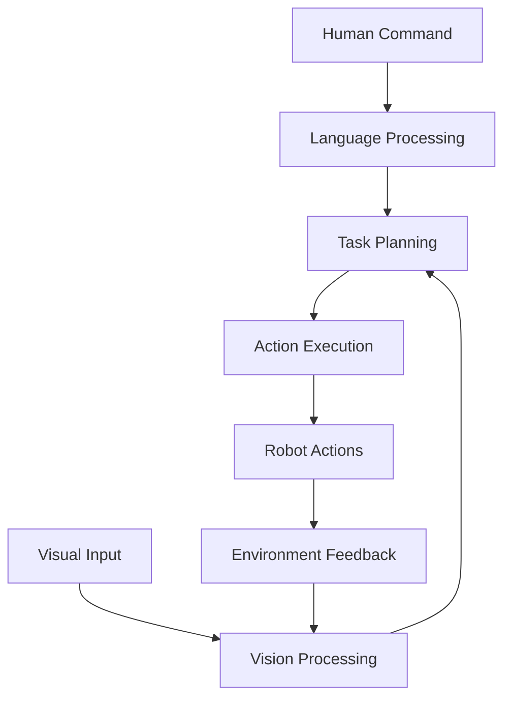

# Chapter 1: Vision-Language-Action in Physical AI

## Learning Objectives

By the end of this chapter, you will be able to:
- Explain the Vision-Language-Action (VLA) paradigm and its significance in Physical AI
- Understand how vision, language, and action components integrate in humanoid robotics
- Identify the relationship between perception, cognition, and action execution
- Recognize the challenges and opportunities in VLA systems

## Introduction to Vision-Language-Action

The Vision-Language-Action (VLA) paradigm represents a significant advancement in Physical AI, enabling robots to perceive their environment visually, understand natural language commands, and execute complex physical tasks. This integration allows humanoid robots to interact naturally with humans and their environment, bridging the gap between symbolic reasoning and physical manipulation.

Unlike traditional robotic systems that operate in isolation, VLA systems create a unified framework where perception, language understanding, and action execution work together seamlessly. This approach enables robots to follow complex, natural language instructions while adapting to dynamic environments through visual feedback.

## The VLA Architecture

### Core Components

The VLA system consists of three interconnected components:

1. **Vision Component**: Processes visual information from cameras and sensors to understand the environment
2. **Language Component**: Interprets natural language commands and translates them into actionable tasks
3. **Action Component**: Executes physical behaviors to accomplish tasks in the real world



### Integration Challenges

The primary challenge in VLA systems is creating effective communication between these components. Each component operates on different types of data and requires different processing approaches:

- Vision processes continuous, high-dimensional sensory data
- Language processes discrete, symbolic information
- Action processes continuous control signals

Successfully integrating these components requires sophisticated algorithms that can translate between these different representations.

## Vision in VLA Systems

### Visual Perception Pipeline

The vision component in VLA systems typically includes:

1. **Object Detection**: Identifying and localizing objects in the environment
2. **Scene Understanding**: Comprehending spatial relationships and context
3. **Visual Tracking**: Following objects and humans over time
4. **Depth Estimation**: Understanding 3D structure for manipulation

### Role in Action Execution

Vision provides crucial feedback for action execution, enabling robots to:
- Verify object properties before manipulation
- Adjust grasps based on object shape and orientation
- Navigate safely around obstacles
- Confirm task completion

## Language Understanding in VLA

### Natural Language Processing

The language component handles:

1. **Speech-to-Text**: Converting spoken commands to text
2. **Intent Recognition**: Understanding the user's goal
3. **Entity Extraction**: Identifying objects, locations, and actions
4. **Command Parsing**: Breaking down complex instructions

### Integration with Vision

Language understanding benefits from visual context:
- Disambiguating references ("the red ball" vs. "the blue ball")
- Understanding spatial relationships ("left of the table")
- Adapting to environmental constraints

## Action Execution and Control

### Task Decomposition

Complex commands are broken down into executable actions:

```
Command: "Go to the kitchen and bring me a red apple"
Decomposed Tasks:
1. Navigate to kitchen
2. Identify red apple
3. Plan grasp trajectory
4. Execute grasp
5. Navigate back
6. Deliver apple
```

### Execution Challenges

Action execution in VLA systems must handle:
- Uncertainty in perception
- Dynamic environments
- Physical constraints
- Safety considerations

## Applications and Use Cases

### Domestic Robotics

VLA systems excel in domestic environments where robots need to understand natural commands and adapt to varied household objects and layouts.

### Industrial Applications

In industrial settings, VLA enables human workers to communicate with robots using natural language, improving collaboration and flexibility.

### Healthcare and Assistive Robotics

Healthcare applications benefit from VLA's ability to understand complex, context-dependent commands while ensuring safety in human environments.

## Building on Previous Modules

This module builds upon concepts from:
- [Module 1: ROS 2](../module-1-ros2/index.md) - for communication and coordination
- [Module 3: NVIDIA Isaac](../module-3-ai-robot-brain/index.md) - for simulation and perception

The VLA paradigm synthesizes these technologies to create more capable and intuitive robotic systems.

## Summary

The Vision-Language-Action paradigm represents a significant step toward truly autonomous humanoid robots. By integrating perception, language understanding, and action execution, VLA systems enable robots to interact naturally with humans and adapt to complex environments. Understanding these fundamentals is crucial for developing advanced robotic applications that can operate effectively in real-world settings.

## Exercises

1. Identify three scenarios where VLA integration provides advantages over isolated perception, language, or action systems
2. Explain how visual feedback can disambiguate natural language commands
3. Describe the challenges in translating high-level language commands to low-level robot actions

## Further Reading

- [A Generalist Robot Foundation Model for Physical Understanding of the World](https://arxiv.org/abs/2401.02412) - Recent advances in VLA models
- [Language-Conditioned Learning for Robotic Manipulation](https://arxiv.org/abs/2206.04659) - Language-guided manipulation techniques