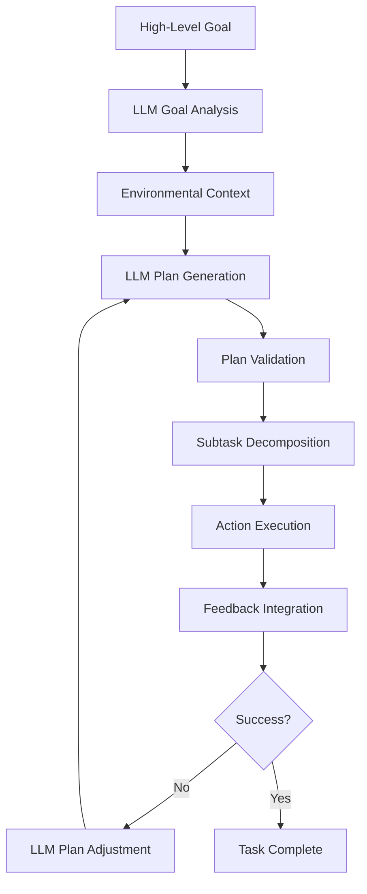

# Chapter 4: LLM-Based Cognitive Planning

## Learning Objectives

By the end of this chapter, you will be able to:
- Integrate Large Language Models (LLMs) for cognitive planning in robotic systems
- Design prompt engineering strategies for effective robot planning
- Implement planning systems that adapt to environmental changes
- Generate high-level strategies for complex robot behaviors
- Handle plan execution failures and recovery using LLM reasoning

## Introduction to LLM-Based Cognitive Planning

Large Language Models (LLMs) have emerged as powerful tools for cognitive planning in robotics, offering the ability to reason about complex, multi-step tasks and generate high-level strategies based on environmental context and task requirements. Unlike traditional planning algorithms that rely on predefined rules and symbolic representations, LLMs can handle natural language descriptions, adapt to novel situations, and leverage vast amounts of world knowledge.

In the Vision-Language-Action paradigm, LLMs serve as the cognitive layer that bridges high-level goals expressed in natural language with executable action sequences. This enables robots to understand complex instructions, reason about their environment, and adapt their plans when encountering unexpected situations.

## Cognitive Architecture with LLMs

### Planning Pipeline Architecture

The LLM-based cognitive planning system follows a multi-stage pipeline:



### Context Integration

LLMs require rich environmental context to generate effective plans:

```python
import json
from typing import Dict, List, Any
from dataclasses import dataclass

@dataclass
class EnvironmentalContext:
    robot_state: Dict[str, Any]
    object_locations: List[Dict]
    spatial_map: Dict[str, Any]
    task_history: List[Dict]
    current_goal: str
    available_actions: List[str]

class ContextBuilder:
    def __init__(self):
        self.perception_interface = None  # Interface to perception system
        self.localization_interface = None  # Interface to localization system
        self.action_interface = None  # Interface to action system

    def build_context(self, goal: str) -> EnvironmentalContext:
        """
        Build comprehensive environmental context for LLM planning
        """
        return EnvironmentalContext(
            robot_state=self.get_robot_state(),
            object_locations=self.get_object_locations(),
            spatial_map=self.get_spatial_map(),
            task_history=self.get_task_history(),
            current_goal=goal,
            available_actions=self.get_available_actions()
        )

    def get_robot_state(self) -> Dict[str, Any]:
        """
        Get current robot state including battery, capabilities, etc.
        """
        # This would interface with robot state publisher
        return {
            "position": {"x": 0.0, "y": 0.0, "theta": 0.0},
            "battery_level": 0.85,
            "gripper_status": "open",
            "current_task": "idle"
        }

    def get_object_locations(self) -> List[Dict]:
        """
        Get locations of relevant objects in the environment
        """
        if self.perception_interface:
            return self.perception_interface.get_object_locations()
        else:
            # Mock data for simulation
            return [
                {"id": "red_apple_1", "type": "apple", "color": "red", "position": {"x": 1.5, "y": 2.0}, "location": "kitchen_table"},
                {"id": "blue_cup_1", "type": "cup", "color": "blue", "position": {"x": 1.8, "y": 2.1}, "location": "kitchen_table"},
                {"id": "book_1", "type": "book", "title": "Robotics", "position": {"x": 0.5, "y": 1.0}, "location": "living_room_table"}
            ]

    def get_spatial_map(self) -> Dict[str, Any]:
        """
        Get spatial map with navigable locations and obstacles
        """
        # This would interface with mapping system
        return {
            "rooms": ["kitchen", "living_room", "bedroom", "office"],
            "waypoints": {
                "kitchen": {"x": 3.0, "y": 4.0},
                "living_room": {"x": 0.0, "y": 0.0},
                "bedroom": {"x": -2.0, "y": 3.0},
                "office": {"x": 1.0, "y": -2.0}
            },
            "obstacles": [{"x": 1.0, "y": 1.0, "type": "furniture"}]
        }

    def get_task_history(self) -> List[Dict]:
        """
        Get history of recent tasks for context
        """
        return [
            {"task": "navigate_to", "params": {"location": "kitchen"}, "result": "success"},
            {"task": "search_object", "params": {"object": "apple"}, "result": "success"}
        ]

    def get_available_actions(self) -> List[str]:
        """
        Get list of available robot actions
        """
        return [
            "navigate_to",
            "grasp_object",
            "place_object",
            "search_object",
            "open_gripper",
            "close_gripper",
            "rotate_object",
            "request_human_help"
        ]
```

## LLM Integration for Planning

### Planning Prompt Engineering

Effective prompt engineering is crucial for LLM-based planning:

```python
class PlanningPromptEngineer:
    def __init__(self):
        self.system_prompt = """
        You are an expert robotic cognitive planner. Your role is to generate detailed, executable plans for humanoid robots operating in indoor environments. Consider the following:

        1. Physical constraints: Robots have limited mobility and manipulation capabilities
        2. Safety: Prioritize safe navigation and manipulation
        3. Efficiency: Generate plans that minimize time and energy
        4. Robustness: Account for uncertainty in perception and execution
        5. Context awareness: Use environmental context to inform decisions

        Output format: Provide a JSON list of actions with parameters.
        """

    def generate_planning_prompt(self, context: EnvironmentalContext) -> str:
        """
        Generate a comprehensive prompt for LLM-based planning
        """
        prompt = f"""
        {self.system_prompt}

        ENVIRONMENTAL CONTEXT:
        Robot State: {json.dumps(context.robot_state, indent=2)}

        Object Locations: {json.dumps(context.object_locations, indent=2)}

        Spatial Map: {json.dumps(context.spatial_map, indent=2)}

        Available Actions: {", ".join(context.available_actions)}

        TASK HISTORY: {json.dumps(context.task_history, indent=2)}

        CURRENT GOAL: {context.current_goal}

        Please generate a detailed plan to achieve this goal. The plan should be a JSON list of actions with the following format:
        [
            {{
                "action": "action_name",
                "parameters": {{
                    "param1": "value1",
                    "param2": "value2"
                }},
                "reasoning": "Brief explanation of why this action is needed"
            }}
        ]

        Ensure the plan is executable, safe, and accounts for the current environmental context.
        """

        return prompt

    def generate_recovery_prompt(self, context: EnvironmentalContext, failure_info: Dict) -> str:
        """
        Generate a prompt for plan recovery after failure
        """
        recovery_prompt = f"""
        {self.system_prompt}

        A robot attempting to execute a plan has encountered a failure. Your task is to generate a recovery plan.

        ORIGINAL GOAL: {context.current_goal}

        FAILURE INFORMATION: {json.dumps(failure_info, indent=2)}

        CURRENT ENVIRONMENTAL CONTEXT: {json.dumps(context.robot_state, indent=2)}

        AVAILABLE ACTIONS: {", ".join(context.available_actions)}

        Please generate a recovery plan that addresses the failure and continues toward the original goal if possible, or suggests an alternative approach. Format as JSON list of actions.
        """

        return recovery_prompt
```

### LLM Planning Interface

Create an interface to interact with LLMs for planning:

```python
import openai
import json
import time
from typing import Optional

class LLMPlanner:
    def __init__(self, model_name: str = "gpt-3.5-turbo"):
        self.model_name = model_name
        self.prompt_engineer = PlanningPromptEngineer()
        self.max_retries = 3
        self.retry_delay = 1.0

    def generate_plan(self, context: EnvironmentalContext) -> Optional[List[Dict]]:
        """
        Generate a plan using LLM based on environmental context
        """
        prompt = self.prompt_engineer.generate_planning_prompt(context)

        for attempt in range(self.max_retries):
            try:
                response = openai.ChatCompletion.create(
                    model=self.model_name,
                    messages=[
                        {"role": "system", "content": self.prompt_engineer.system_prompt},
                        {"role": "user", "content": prompt}
                    ],
                    temperature=0.3,  # Lower temperature for more consistent planning
                    max_tokens=1000,
                    response_format={"type": "json_object"}  # Ensure JSON output
                )

                # Extract and parse the plan
                plan_text = response.choices[0].message.content
                plan = json.loads(plan_text)

                # Validate the plan structure
                if self.validate_plan(plan):
                    return plan["plan"] if "plan" in plan else plan
                else:
                    print(f"Invalid plan format on attempt {attempt + 1}")

            except json.JSONDecodeError:
                print(f"Failed to parse JSON response on attempt {attempt + 1}")
            except Exception as e:
                print(f"LLM call failed on attempt {attempt + 1}: {e}")

            if attempt < self.max_retries - 1:
                time.sleep(self.retry_delay)

        return None

    def generate_recovery_plan(self, context: EnvironmentalContext, failure_info: Dict) -> Optional[List[Dict]]:
        """
        Generate a recovery plan after execution failure
        """
        prompt = self.prompt_engineer.generate_recovery_prompt(context, failure_info)

        for attempt in range(self.max_retries):
            try:
                response = openai.ChatCompletion.create(
                    model=self.model_name,
                    messages=[
                        {"role": "system", "content": self.prompt_engineer.system_prompt},
                        {"role": "user", "content": prompt}
                    ],
                    temperature=0.5,  # Slightly higher temperature for creative recovery
                    max_tokens=800,
                    response_format={"type": "json_object"}
                )

                plan_text = response.choices[0].message.content
                plan = json.loads(plan_text)

                if self.validate_plan(plan):
                    return plan["plan"] if "plan" in plan else plan

            except json.JSONDecodeError:
                print(f"Failed to parse recovery plan JSON on attempt {attempt + 1}")
            except Exception as e:
                print(f"LLM recovery call failed on attempt {attempt + 1}: {e}")

            if attempt < self.max_retries - 1:
                time.sleep(self.retry_delay)

        return None

    def validate_plan(self, plan: Any) -> bool:
        """
        Validate that the plan is in the expected format
        """
        if not isinstance(plan, list) and "plan" not in plan:
            return False

        plan_list = plan["plan"] if "plan" in plan else plan

        if not isinstance(plan_list, list):
            return False

        for action in plan_list:
            if not isinstance(action, dict) or "action" not in action:
                return False

        return True
```

## Plan Execution and Monitoring

### Plan Execution Manager

Manage the execution of LLM-generated plans:

```python
from enum import Enum
import asyncio
from typing import Tuple

class ExecutionStatus(Enum):
    PENDING = "pending"
    EXECUTING = "executing"
    SUCCESS = "success"
    FAILED = "failed"
    RECOVERING = "recovering"

class PlanExecutionManager:
    def __init__(self):
        self.current_plan = []
        self.current_status = ExecutionStatus.PENDING
        self.current_action_index = 0
        self.llm_planner = LLMPlanner()
        self.context_builder = ContextBuilder()

    async def execute_plan(self, plan: List[Dict], goal: str) -> Tuple[ExecutionStatus, List[Dict]]:
        """
        Execute a plan and return final status and execution log
        """
        self.current_plan = plan
        self.current_status = ExecutionStatus.EXECUTING
        self.current_action_index = 0
        execution_log = []

        while self.current_action_index < len(plan):
            action = plan[self.current_action_index]

            # Execute the action
            success, result = await self.execute_single_action(action)

            execution_log.append({
                "action": action,
                "result": result,
                "success": success,
                "timestamp": time.time()
            })

            if success:
                self.current_action_index += 1
            else:
                # Handle failure
                failure_info = {
                    "failed_action": action,
                    "error": result,
                    "plan_index": self.current_action_index,
                    "goal": goal
                }

                recovery_plan = await self.handle_failure(failure_info)
                if recovery_plan:
                    # Insert recovery plan at current position
                    plan[self.current_action_index:self.current_action_index+1] = recovery_plan
                else:
                    self.current_status = ExecutionStatus.FAILED
                    return self.current_status, execution_log

        self.current_status = ExecutionStatus.SUCCESS
        return self.current_status, execution_log

    async def execute_single_action(self, action: Dict) -> Tuple[bool, str]:
        """
        Execute a single action and return success status and result
        """
        action_name = action["action"]
        parameters = action.get("parameters", {})

        try:
            # This would interface with actual robot action execution
            # For simulation, we'll implement mock execution
            success = await self.mock_action_execution(action_name, parameters)
            return success, f"Action {action_name} completed successfully" if success else f"Action {action_name} failed"
        except Exception as e:
            return False, f"Action {action_name} failed with error: {str(e)}"

    async def handle_failure(self, failure_info: Dict) -> Optional[List[Dict]]:
        """
        Handle execution failure by generating recovery plan
        """
        # Build current context
        context = self.context_builder.build_context(failure_info["goal"])

        # Generate recovery plan using LLM
        recovery_plan = self.llm_planner.generate_recovery_plan(context, failure_info)

        if recovery_plan:
            self.current_status = ExecutionStatus.RECOVERING
            return recovery_plan
        else:
            # If LLM fails to generate recovery, try simple fallbacks
            return self.generate_simple_recovery(failure_info)

    def generate_simple_recovery(self, failure_info: Dict) -> Optional[List[Dict]]:
        """
        Generate simple recovery plan when LLM fails
        """
        failed_action = failure_info["failed_action"]["action"]

        # Simple recovery strategies based on action type
        if failed_action == "navigate_to":
            return [
                {"action": "request_human_help", "parameters": {"reason": "Navigation failed", "location": failure_info["failed_action"].get("parameters", {}).get("location")}}
            ]
        elif failed_action == "grasp_object":
            return [
                {"action": "request_human_help", "parameters": {"reason": "Grasping failed", "object": failure_info["failed_action"].get("parameters", {}).get("object")}}
            ]
        else:
            return [
                {"action": "request_human_help", "parameters": {"reason": f"Action {failed_action} failed"}}
            ]

    async def mock_action_execution(self, action_name: str, parameters: Dict) -> bool:
        """
        Mock action execution for simulation purposes
        """
        import random

        # Simulate action execution time
        await asyncio.sleep(0.1)  # 100ms per action

        # Simulate success/failure based on action type
        success_rate = {
            "navigate_to": 0.95,
            "grasp_object": 0.85,
            "place_object": 0.90,
            "search_object": 0.98,
            "open_gripper": 0.99,
            "close_gripper": 0.99
        }

        base_success_rate = success_rate.get(action_name, 0.90)
        return random.random() < base_success_rate
```

## Advanced Planning Strategies

### Multi-Modal Planning

Combine LLM planning with perception and navigation:

```python
class MultiModalPlanner:
    def __init__(self):
        self.llm_planner = LLMPlanner()
        self.context_builder = ContextBuilder()
        self.execution_manager = PlanExecutionManager()

    def create_cognitive_plan(self, natural_language_goal: str) -> Optional[List[Dict]]:
        """
        Create a cognitive plan from natural language goal
        """
        # Build environmental context
        context = self.context_builder.build_context(natural_language_goal)

        # Generate plan using LLM
        plan = self.llm_planner.generate_plan(context)

        if plan:
            # Validate and refine the plan
            refined_plan = self.refine_plan_with_constraints(plan, context)
            return refined_plan
        else:
            return None

    def refine_plan_with_constraints(self, plan: List[Dict], context: EnvironmentalContext) -> List[Dict]:
        """
        Refine LLM-generated plan with environmental constraints
        """
        refined_plan = []

        for action in plan:
            # Check if action is feasible given current context
            if self.is_action_feasible(action, context):
                refined_plan.append(action)
            else:
                # Generate alternative action or skip
                alternative = self.generate_alternative_action(action, context)
                if alternative:
                    refined_plan.append(alternative)

        return refined_plan

    def is_action_feasible(self, action: Dict, context: EnvironmentalContext) -> bool:
        """
        Check if an action is feasible given environmental constraints
        """
        action_name = action["action"]
        params = action.get("parameters", {})

        if action_name == "navigate_to":
            location = params.get("location")
            if location and location in context.spatial_map["waypoints"]:
                return True
            return False
        elif action_name == "grasp_object":
            obj_id = params.get("object_id")
            if obj_id:
                # Check if object exists in environment
                for obj in context.object_locations:
                    if obj["id"] == obj_id:
                        return True
            return False
        else:
            # For other actions, assume feasible if parameters exist
            return len(params) > 0

    def generate_alternative_action(self, original_action: Dict, context: EnvironmentalContext) -> Optional[Dict]:
        """
        Generate alternative action when original is not feasible
        """
        action_name = original_action["action"]
        original_params = original_action.get("parameters", {})

        if action_name == "navigate_to":
            # Try to find closest valid location
            target_location = original_params.get("location", "")
            for location in context.spatial_map["waypoints"]:
                if target_location.lower() in location.lower() or location.lower() in target_location.lower():
                    return {
                        "action": "navigate_to",
                        "parameters": {"location": location},
                        "reasoning": f"Closest match to requested location: {target_location}"
                    }

        # If no alternative found, suggest human help
        return {
            "action": "request_human_help",
            "parameters": {
                "reason": f"Could not execute action: {action_name}",
                "original_params": original_params
            },
            "reasoning": "Action not feasible with current environmental constraints"
        }
```

## Context-Aware Planning

### Dynamic Context Updates

Update planning context based on execution feedback:

```python
class ContextAwarePlanner:
    def __init__(self):
        self.llm_planner = LLMPlanner()
        self.context_builder = ContextBuilder()
        self.knowledge_base = {}  # Store learned information

    def update_context_from_execution(self, execution_log: List[Dict], context: EnvironmentalContext) -> EnvironmentalContext:
        """
        Update context based on execution results
        """
        updated_context = context

        for log_entry in execution_log:
            action = log_entry["action"]
            success = log_entry["success"]

            if action["action"] == "search_object" and success:
                # Update object locations based on successful search
                obj_found = action.get("parameters", {}).get("object")
                if obj_found:
                    # Add to knowledge base
                    self.knowledge_base[f"location_of_{obj_found}"] = "recently_found"

            elif action["action"] == "navigate_to" and success:
                # Update robot position
                location = action.get("parameters", {}).get("location")
                if location:
                    updated_context.robot_state["position"] = updated_context.spatial_map["waypoints"].get(location, {"x": 0, "y": 0})

        return updated_context

    def adaptive_planning(self, goal: str, previous_execution_log: Optional[List[Dict]] = None) -> Optional[List[Dict]]:
        """
        Generate plan that adapts based on previous execution results
        """
        # Build initial context
        context = self.context_builder.build_context(goal)

        # Update context if previous execution information is available
        if previous_execution_log:
            context = self.update_context_from_execution(previous_execution_log, context)

        # Generate plan
        plan = self.llm_planner.generate_plan(context)

        return plan
```

## Integration with ROS 2

### Planning Action Server

Create a ROS 2 action server for LLM-based planning:

```python
import rclpy
from rclpy.action import ActionServer, GoalResponse, CancelResponse
from rclpy.node import Node
from vla_planning_msgs.action import GeneratePlan  # Custom action message
import threading

class LLMPlanningServer(Node):
    def __init__(self):
        super().__init__('llm_planning_server')

        # Initialize planning components
        self.planner = MultiModalPlanner()
        self.context_builder = ContextBuilder()

        # Create action server
        self._action_server = ActionServer(
            self,
            GeneratePlan,
            'generate_plan',
            self.execute_callback,
            goal_callback=self.goal_callback,
            cancel_callback=self.cancel_callback
        )

    def goal_callback(self, goal_request):
        """
        Accept or reject planning goal
        """
        self.get_logger().info(f'Received plan generation request for goal: {goal_request.goal_description}')
        return GoalResponse.ACCEPT

    def cancel_callback(self, goal_handle):
        """
        Accept or reject planning cancellation
        """
        self.get_logger().info('Received plan generation cancellation request')
        return CancelResponse.ACCEPT

    def execute_callback(self, goal_handle):
        """
        Execute the plan generation goal
        """
        self.get_logger().info('Executing plan generation request')

        try:
            # Create plan using LLM
            plan = self.planner.create_cognitive_plan(goal_handle.request.goal_description)

            if plan is not None:
                # Convert plan to action result
                result = GeneratePlan.Result()
                result.success = True
                result.plan = self.convert_plan_to_messages(plan)
                result.goal_description = goal_handle.request.goal_description

                goal_handle.succeed()
                self.get_logger().info('Successfully generated plan')
                return result
            else:
                # Planning failed
                result = GeneratePlan.Result()
                result.success = False
                result.error_message = "LLM failed to generate a valid plan"
                result.plan = []

                goal_handle.abort()
                self.get_logger().error('Failed to generate plan')
                return result

        except Exception as e:
            self.get_logger().error(f'Plan generation failed: {str(e)}')
            result = GeneratePlan.Result()
            result.success = False
            result.error_message = str(e)
            result.plan = []

            goal_handle.abort()
            return result

    def convert_plan_to_messages(self, plan: List[Dict]) -> List:
        """
        Convert internal plan representation to ROS 2 messages
        """
        # This would convert the plan to appropriate ROS 2 message types
        # Implementation depends on the specific message definitions
        pass

def main(args=None):
    rclpy.init(args=args)
    server = LLMPlanningServer()

    try:
        rclpy.spin(server)
    except KeyboardInterrupt:
        pass
    finally:
        server.destroy_node()
        rclpy.shutdown()
```

## Handling Uncertainty and Adaptation

### Uncertainty-Aware Planning

Account for uncertainty in LLM planning:

```python
import numpy as np
from typing import Union

class UncertaintyAwarePlanner:
    def __init__(self):
        self.llm_planner = LLMPlanner()
        self.uncertainty_threshold = 0.7  # Threshold for plan confidence

    def generate_plan_with_uncertainty(self, context: EnvironmentalContext) -> Tuple[Optional[List[Dict]], float]:
        """
        Generate plan and estimate its uncertainty/confidence
        """
        # Generate multiple plans with slight variations in temperature
        plans_and_confidences = []

        for temp in [0.2, 0.3, 0.4]:  # Different temperature settings
            context_copy = self.copy_context(context)  # Assuming context is copyable
            plan = self.llm_planner.generate_plan(context_copy)
            if plan:
                confidence = self.estimate_plan_confidence(plan, context)
                plans_and_confidences.append((plan, confidence))

        if plans_and_confidences:
            # Select plan with highest confidence
            best_plan, best_confidence = max(plans_and_confidences, key=lambda x: x[1])

            if best_confidence >= self.uncertainty_threshold:
                return best_plan, best_confidence
            else:
                # Low confidence - suggest human oversight
                return self.generate_cautionary_plan(best_plan, context), best_confidence
        else:
            return None, 0.0

    def estimate_plan_confidence(self, plan: List[Dict], context: EnvironmentalContext) -> float:
        """
        Estimate confidence in the generated plan
        """
        confidence_factors = []

        # Factor 1: Plan length (shorter plans generally more reliable)
        length_factor = max(0.5, 1.0 - len(plan) * 0.05)  # Decreases with length
        confidence_factors.append(length_factor)

        # Factor 2: Action complexity
        complex_actions = ["grasp_object", "manipulate_object", "assemble"]
        complex_action_count = sum(1 for action in plan if action["action"] in complex_actions)
        complexity_factor = max(0.3, 1.0 - complex_action_count * 0.1)
        confidence_factors.append(complexity_factor)

        # Factor 3: Environmental familiarity
        familiar_locations = set(context.spatial_map["waypoints"].keys())
        plan_locations = set()
        for action in plan:
            if "location" in action.get("parameters", {}):
                plan_locations.add(action["parameters"]["location"])

        familiarity_factor = len(plan_locations.intersection(familiar_locations)) / max(1, len(plan_locations))
        confidence_factors.append(familiarity_factor)

        # Average all factors
        return np.mean(confidence_factors)

    def generate_cautionary_plan(self, original_plan: List[Dict], context: EnvironmentalContext) -> List[Dict]:
        """
        Generate a more conservative plan when confidence is low
        """
        cautious_plan = []

        for action in original_plan:
            # Add safety checks before complex actions
            if action["action"] in ["grasp_object", "navigate_to", "manipulate_object"]:
                # Add verification step
                cautious_plan.append({
                    "action": "verify_environment",
                    "parameters": {"target": action.get("parameters", {}).get("location") or action.get("parameters", {}).get("object")},
                    "reasoning": "Safety check before executing potentially risky action"
                })

            # Add the original action
            cautious_plan.append(action)

            # Add verification after action
            cautious_plan.append({
                "action": "verify_action_success",
                "parameters": {"action": action["action"]},
                "reasoning": "Verify that action was completed successfully"
            })

        return cautious_plan

    def copy_context(self, context: EnvironmentalContext) -> EnvironmentalContext:
        """
        Create a copy of the environmental context
        """
        import copy
        return copy.deepcopy(context)
```

## Performance Optimization

### Caching and Plan Reuse

Optimize planning performance through caching:

```python
from functools import lru_cache
import hashlib

class OptimizedLLMPlanner:
    def __init__(self, llm_planner: LLMPlanner):
        self.llm_planner = llm_planner
        self.plan_cache = {}
        self.max_cache_size = 50

    @lru_cache(maxsize=50)
    def cached_plan_generation(self, context_hash: str, goal: str) -> Optional[List[Dict]]:
        """
        Cached plan generation to avoid repeated LLM calls
        """
        # This would call the actual LLM planner
        # For simulation, we'll use a mock implementation
        context = self.reconstruct_context_from_hash(context_hash)
        if context:
            return self.llm_planner.generate_plan(context)
        return None

    def get_context_hash(self, context: EnvironmentalContext) -> str:
        """
        Generate a hash for the environmental context
        """
        context_str = f"{context.current_goal}_{len(context.object_locations)}_{len(context.spatial_map['waypoints'])}"
        return hashlib.md5(context_str.encode()).hexdigest()

    def reconstruct_context_from_hash(self, context_hash: str) -> Optional[EnvironmentalContext]:
        """
        Reconstruct context from hash (simplified for this example)
        """
        # In a real implementation, you would store full context objects
        # This is a simplified version for demonstration
        return None

    def generate_plan_with_cache(self, context: EnvironmentalContext) -> Optional[List[Dict]]:
        """
        Generate plan using caching to improve performance
        """
        context_hash = self.get_context_hash(context)

        # Check if plan exists in cache
        cache_key = f"{context_hash}_{context.current_goal}"

        if cache_key in self.plan_cache:
            self.get_logger().info("Using cached plan")
            return self.plan_cache[cache_key]

        # Generate new plan
        plan = self.llm_planner.generate_plan(context)

        # Cache the plan if successful
        if plan and len(self.plan_cache) < self.max_cache_size:
            self.plan_cache[cache_key] = plan

        return plan

    def get_logger(self):
        """
        Mock logger for example
        """
        class MockLogger:
            def info(self, msg):
                print(f"INFO: {msg}")
        return MockLogger()
```

## Summary

LLM-based cognitive planning provides a powerful approach to generating high-level strategies for complex robotic tasks. By combining natural language understanding with environmental context and action execution, robots can reason about their goals and adapt to changing conditions.

Key aspects of effective LLM-based planning include:
1. Proper prompt engineering for consistent outputs
2. Integration with environmental perception and state
3. Robust execution and recovery mechanisms
4. Uncertainty handling and safety considerations
5. Performance optimization through caching and reuse

## Exercises

1. Implement an LLM-based planner that can handle the goal "Clean up the living room by putting books on the shelf and cups in the kitchen"
2. Add uncertainty estimation to your planning system and implement cautionary behaviors for low-confidence plans
3. Create a plan recovery system that can handle navigation failures by asking for human help
4. Implement plan caching to improve performance for repeated tasks

## Further Reading

- [Language Models for Robotics](https://arxiv.org/abs/2309.13874) - Recent advances in LLM applications for robotics
- [Cognitive Architectures for Robotics](https://arxiv.org/abs/2206.04615) - Integration of reasoning and planning
- [Uncertainty-Aware Planning](https://arxiv.org/abs/2108.02274) - Handling uncertainty in robotic planning