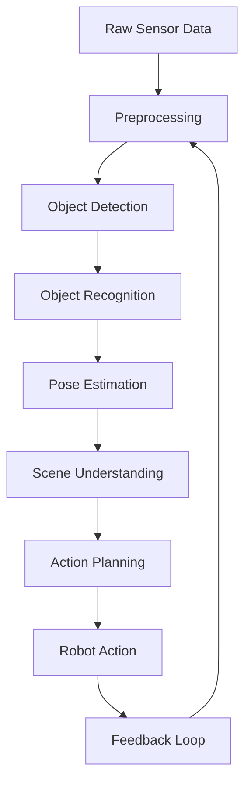

# Chapter 5: Vision-Guided Action and Object Interaction

## Learning Objectives

By the end of this chapter, you will be able to:
- Integrate computer vision systems with robotic action execution
- Implement object detection and recognition for robotic manipulation
- Create perception-action loops for closed-loop robotic control
- Handle object interaction challenges including grasping and manipulation
- Design vision-guided navigation systems for dynamic environments

## Introduction to Vision-Guided Action

Vision-guided action represents the integration of visual perception with robotic action execution, enabling robots to interact with objects and navigate safely in real-world environments. In the Vision-Language-Action paradigm, the vision system provides crucial feedback that bridges the gap between high-level planning and low-level action execution.

Unlike open-loop systems that execute pre-programmed actions, vision-guided systems continuously adapt their behavior based on visual feedback, enabling robust operation in unstructured environments. This closed-loop approach is essential for tasks requiring precise manipulation, dynamic obstacle avoidance, and interaction with previously unknown objects.

## Computer Vision for Robotics

### Vision Pipeline Architecture

The vision system for robotic applications typically follows a multi-stage pipeline:



### Essential Vision Components

For robotic applications, the vision system must provide:

1. **Real-time processing**: Fast enough for interactive applications
2. **Robust detection**: Works under varying lighting and conditions
3. **Accurate pose estimation**: Precise object location and orientation
4. **Scene understanding**: Contextual information for decision making

```python
import cv2
import numpy as np
import torch
from typing import List, Dict, Tuple, Optional
from dataclasses import dataclass

@dataclass
class ObjectInfo:
    id: str
    class_name: str
    confidence: float
    bbox: Tuple[int, int, int, int]  # x, y, width, height
    position_3d: Tuple[float, float, float]  # x, y, z in robot coordinate frame
    rotation_3d: Tuple[float, float, float]  # roll, pitch, yaw

@dataclass
class VisionResult:
    objects: List[ObjectInfo]
    scene_description: str
    timestamp: float
    processing_time: float

class RobotVisionSystem:
    def __init__(self, camera_matrix: np.ndarray, distortion_coeffs: np.ndarray):
        self.camera_matrix = camera_matrix
        self.distortion_coeffs = distortion_coeffs
        self.object_detector = self.initialize_object_detector()
        self.pose_estimator = self.initialize_pose_estimator()
        self.scene_analyzer = self.initialize_scene_analyzer()

    def initialize_object_detector(self):
        """
        Initialize object detection model (e.g., YOLO, Detectron2)
        """
        # In practice, this would load a pre-trained model
        # For simulation, we'll create a mock detector
        class MockDetector:
            def detect(self, image):
                # Mock detection results
                return [
                    ObjectInfo(
                        id="apple_1",
                        class_name="apple",
                        confidence=0.92,
                        bbox=(100, 150, 50, 50),
                        position_3d=(0.5, 0.3, 1.0),
                        rotation_3d=(0.0, 0.0, 0.0)
                    ),
                    ObjectInfo(
                        id="cup_1",
                        class_name="cup",
                        confidence=0.88,
                        bbox=(200, 100, 40, 60),
                        position_3d=(0.7, 0.1, 1.0),
                        rotation_3d=(0.0, 0.0, 0.0)
                    )
                ]
        return MockDetector()

    def initialize_pose_estimator(self):
        """
        Initialize 3D pose estimation system
        """
        class MockPoseEstimator:
            def estimate_pose(self, object_info: ObjectInfo, image: np.ndarray):
                # In practice, this would use PnP algorithms or deep learning
                # For simulation, return identity transformation
                return object_info.position_3d, object_info.rotation_3d
        return MockPoseEstimator()

    def initialize_scene_analyzer(self):
        """
        Initialize scene understanding system
        """
        class MockSceneAnalyzer:
            def analyze_scene(self, objects: List[ObjectInfo]) -> str:
                # Generate scene description
                object_names = [obj.class_name for obj in objects]
                return f"Scene contains: {', '.join(object_names)}"
        return MockSceneAnalyzer()

    def process_frame(self, image: np.ndarray) -> VisionResult:
        """
        Process a single camera frame
        """
        start_time = cv2.getTickCount()

        # Detect objects
        detected_objects = self.object_detector.detect(image)

        # Estimate 3D poses
        for obj in detected_objects:
            pos_3d, rot_3d = self.pose_estimator.estimate_pose(obj, image)
            obj.position_3d = pos_3d
            obj.rotation_3d = rot_3d

        # Analyze scene
        scene_description = self.scene_analyzer.analyze_scene(detected_objects)

        # Calculate processing time
        end_time = cv2.getTickCount()
        processing_time = (end_time - start_time) / cv2.getTickFrequency()

        return VisionResult(
            objects=detected_objects,
            scene_description=scene_description,
            timestamp=time.time(),
            processing_time=processing_time
        )
```

## Object Detection and Recognition

### Deep Learning Approaches

Modern robotic vision systems leverage deep learning for robust object detection:

```python
import torchvision
from torchvision.models.detection import fasterrcnn_resnet50_fpn
import torchvision.transforms as T

class DeepObjectDetector:
    def __init__(self, confidence_threshold: float = 0.5):
        self.confidence_threshold = confidence_threshold
        self.model = self.load_pretrained_model()
        self.transform = T.Compose([T.ToTensor()])

    def load_pretrained_model(self):
        """
        Load a pre-trained object detection model
        """
        # Load Faster R-CNN pre-trained on COCO
        model = fasterrcnn_resnet50_fpn(pretrained=True)
        model.eval()
        return model

    def detect_objects(self, image: np.ndarray) -> List[ObjectInfo]:
        """
        Detect objects in an image using deep learning
        """
        # Convert image to tensor
        image_tensor = self.transform(image).unsqueeze(0)

        with torch.no_grad():
            predictions = self.model(image_tensor)

        # Process predictions
        boxes = predictions[0]['boxes'].cpu().numpy()
        labels = predictions[0]['labels'].cpu().numpy()
        scores = predictions[0]['scores'].cpu().numpy()

        objects = []
        height, width = image.shape[:2]

        for i in range(len(boxes)):
            if scores[i] > self.confidence_threshold:
                box = boxes[i]
                x, y, x2, y2 = box
                bbox = (int(x), int(y), int(x2 - x), int(y2 - y))

                # Convert COCO label to class name
                class_name = self.coco_id_to_name(labels[i])

                objects.append(ObjectInfo(
                    id=f"{class_name}_{i}",
                    class_name=class_name,
                    confidence=float(scores[i]),
                    bbox=bbox,
                    position_3d=(0.0, 0.0, 0.0),  # Will be calculated separately
                    rotation_3d=(0.0, 0.0, 0.0)
                ))

        return objects

    def coco_id_to_name(self, coco_id: int) -> str:
        """
        Convert COCO dataset ID to class name
        """
        coco_names = [
            '__background__', 'person', 'bicycle', 'car', 'motorcycle', 'airplane', 'bus',
            'train', 'truck', 'boat', 'traffic light', 'fire hydrant', 'stop sign',
            'parking meter', 'bench', 'bird', 'cat', 'dog', 'horse', 'sheep', 'cow',
            'elephant', 'bear', 'zebra', 'giraffe', 'backpack', 'umbrella', 'handbag',
            'tie', 'suitcase', 'frisbee', 'skis', 'snowboard', 'sports ball', 'kite',
            'baseball bat', 'baseball glove', 'skateboard', 'surfboard', 'tennis racket',
            'bottle', 'wine glass', 'cup', 'fork', 'knife', 'spoon', 'bowl', 'banana',
            'apple', 'sandwich', 'orange', 'broccoli', 'carrot', 'hot dog', 'pizza',
            'donut', 'cake', 'chair', 'couch', 'potted plant', 'bed', 'dining table',
            'toilet', 'tv', 'laptop', 'mouse', 'remote', 'keyboard', 'cell phone',
            'microwave', 'oven', 'toaster', 'sink', 'refrigerator', 'book', 'clock',
            'vase', 'scissors', 'teddy bear', 'hair drier', 'toothbrush'
        ]
        return coco_names[coco_id] if coco_id < len(coco_names) else f"unknown_{coco_id}"
```

### Custom Object Detection

For specific robotic applications, custom object detection models may be needed:

```python
class CustomObjectDetector:
    def __init__(self, model_path: str):
        self.model = self.load_custom_model(model_path)
        self.object_classes = self.load_class_definitions()

    def load_custom_model(self, model_path: str):
        """
        Load a custom-trained object detection model
        """
        # This would load a model trained on specific objects for the robot's environment
        # Implementation depends on the specific model format and framework used
        pass

    def load_class_definitions(self) -> Dict[str, Dict]:
        """
        Load class-specific information for robotic interaction
        """
        return {
            "cup": {
                "grasp_points": ["handle", "rim"],
                "orientation": "upright",
                "manipulation_type": "grip"
            },
            "book": {
                "grasp_points": ["spine", "edge"],
                "orientation": "any",
                "manipulation_type": "pinch"
            },
            "apple": {
                "grasp_points": ["surface"],
                "orientation": "any",
                "manipulation_type": "enclose"
            }
        }

    def detect_custom_objects(self, image: np.ndarray) -> List[ObjectInfo]:
        """
        Detect custom objects with robotic-specific attributes
        """
        # Implementation would use the custom model to detect objects
        # and return information relevant for robotic manipulation
        pass
```

## Pose Estimation and 3D Understanding

### Camera Calibration and 3D Reconstruction

Accurate 3D pose estimation is crucial for robotic manipulation:

```python
class PoseEstimator:
    def __init__(self, camera_matrix: np.ndarray, distortion_coeffs: np.ndarray):
        self.camera_matrix = camera_matrix
        self.distortion_coeffs = distortion_coeffs

    def estimate_3d_pose(self, object_info: ObjectInfo, image: np.ndarray) -> Tuple[Tuple, Tuple]:
        """
        Estimate 3D position and orientation of an object
        """
        # Get 2D bounding box
        x, y, w, h = object_info.bbox
        center_x, center_y = x + w//2, y + h//2

        # Undistort points
        points = np.array([[[center_x, center_y]]], dtype=np.float32)
        undistorted = cv2.undistortPoints(
            points,
            self.camera_matrix,
            self.distortion_coeffs,
            P=self.camera_matrix
        )

        # Convert to 3D using depth information (from stereo or depth camera)
        # This is a simplified approach - in practice, you'd use more sophisticated methods
        depth = self.estimate_depth_from_context(object_info, image)

        # Calculate 3D position
        x_3d = (undistorted[0][0][0] - self.camera_matrix[0, 2]) * depth / self.camera_matrix[0, 0]
        y_3d = (undistorted[0][0][1] - self.camera_matrix[1, 2]) * depth / self.camera_matrix[1, 1]
        z_3d = depth

        return (x_3d, y_3d, z_3d), (0.0, 0.0, 0.0)  # For simplicity, zero rotation

    def estimate_depth_from_context(self, object_info: ObjectInfo, image: np.ndarray) -> float:
        """
        Estimate depth using object size and context
        """
        # This would use various depth estimation techniques:
        # - Stereo vision
        # - Structure from motion
        # - Monocular depth estimation
        # - Object size priors

        # For simulation, return a mock value
        return 1.0  # meters

    def estimate_object_orientation(self, object_info: ObjectInfo, image: np.ndarray) -> Tuple[float, float, float]:
        """
        Estimate object orientation (roll, pitch, yaw)
        """
        # This would use pose estimation algorithms like PnP
        # or deep learning-based pose estimation

        # For simulation, return identity orientation
        return 0.0, 0.0, 0.0
```

## Perception-Action Loop

### Closed-Loop Control Architecture

The perception-action loop enables adaptive robotic behavior:

```python
import time
from enum import Enum

class ControlState(Enum):
    IDLE = "idle"
    PERCEIVING = "perceiving"
    PLANNING = "planning"
    EXECUTING = "executing"
    ADJUSTING = "adjusting"
    COMPLETED = "completed"
    FAILED = "failed"

class PerceptionActionLoop:
    def __init__(self, vision_system: RobotVisionSystem, action_executor: Any):
        self.vision_system = vision_system
        self.action_executor = action_executor
        self.current_state = ControlState.IDLE
        self.target_object = None
        self.target_location = None
        self.max_iterations = 100
        self.iteration_count = 0

    def run_loop(self, task_description: str) -> bool:
        """
        Run the perception-action loop until task completion or failure
        """
        self.iteration_count = 0

        # Parse task to identify target
        self.parse_task(task_description)

        while self.iteration_count < self.max_iterations:
            self.iteration_count += 1

            if self.current_state == ControlState.IDLE:
                self.current_state = ControlState.PERCEIVING

            elif self.current_state == ControlState.PERCEIVING:
                vision_result = self.vision_system.process_frame(self.get_current_image())
                self.analyze_perception_result(vision_result)

            elif self.current_state == ControlState.PLANNING:
                plan = self.generate_action_plan()
                if plan:
                    self.current_state = ControlState.EXECUTING
                else:
                    self.current_state = ControlState.FAILED

            elif self.current_state == ControlState.EXECUTING:
                success = self.execute_action_plan(plan)
                if success:
                    self.current_state = ControlState.COMPLETED
                else:
                    self.current_state = ControlState.ADJUSTING

            elif self.current_state == ControlState.ADJUSTING:
                # Adjust based on new perception
                self.current_state = ControlState.PERCEIVING

            elif self.current_state in [ControlState.COMPLETED, ControlState.FAILED]:
                break

            # Small delay to prevent overwhelming the system
            time.sleep(0.05)

        return self.current_state == ControlState.COMPLETED

    def parse_task(self, task_description: str):
        """
        Parse task description to identify targets
        """
        # Simple parsing for demonstration
        if "apple" in task_description.lower():
            self.target_object = "apple"
        elif "cup" in task_description.lower():
            self.target_object = "cup"

        if "table" in task_description.lower():
            self.target_location = "table"
        elif "kitchen" in task_description.lower():
            self.target_location = "kitchen"

    def analyze_perception_result(self, vision_result: VisionResult):
        """
        Analyze vision results and update planning state
        """
        if self.target_object:
            # Find target object in scene
            target_found = False
            for obj in vision_result.objects:
                if obj.class_name == self.target_object and obj.confidence > 0.7:
                    self.target_3d_position = obj.position_3d
                    target_found = True
                    break

            if target_found:
                self.current_state = ControlState.PLANNING
            else:
                # Target not found - need to search
                self.current_state = ControlState.ADJUSTING
        else:
            self.current_state = ControlState.PLANNING

    def generate_action_plan(self) -> Optional[List[Dict]]:
        """
        Generate action plan based on perception results
        """
        if hasattr(self, 'target_3d_position'):
            # Generate plan to approach and interact with target
            return [
                {
                    "action": "navigate_to",
                    "params": {
                        "x": self.target_3d_position[0],
                        "y": self.target_3d_position[1],
                        "approach_distance": 0.5  # 50cm from object
                    }
                },
                {
                    "action": "align_with_object",
                    "params": {
                        "object_position": self.target_3d_position
                    }
                },
                {
                    "action": "grasp_object",
                    "params": {
                        "object_id": self.target_object
                    }
                }
            ]
        return None

    def execute_action_plan(self, plan: List[Dict]) -> bool:
        """
        Execute the action plan
        """
        for action in plan:
            success = self.action_executor.execute(action)
            if not success:
                return False
        return True

    def get_current_image(self) -> np.ndarray:
        """
        Get current image from robot's camera
        """
        # This would interface with the robot's camera system
        # For simulation, return a black image
        return np.zeros((480, 640, 3), dtype=np.uint8)
```

## Object Interaction and Manipulation

### Grasp Planning and Execution

Plan and execute object grasping based on visual information:

```python
@dataclass
class GraspPose:
    position: Tuple[float, float, float]
    orientation: Tuple[float, float, float, float]  # quaternion
    approach_direction: Tuple[float, float, float]
    grasp_type: str  # "pinch", "power", "suction", etc.

class GraspPlanner:
    def __init__(self, robot_ee_limits: Dict):
        self.robot_ee_limits = robot_ee_limits
        self.grasp_database = self.load_grasp_database()

    def load_grasp_database(self) -> Dict:
        """
        Load pre-computed grasp poses for common objects
        """
        return {
            "cup": [
                GraspPose(
                    position=(0.05, 0.0, 0.1),  # offset from object center
                    orientation=(0.0, 0.0, 0.0, 1.0),  # w, x, y, z quaternion
                    approach_direction=(0.0, 0.0, -1.0),
                    grasp_type="cylindrical"
                ),
                GraspPose(
                    position=(0.0, 0.05, 0.05),  # grasp handle
                    orientation=(0.0, 0.707, 0.0, 0.707),
                    approach_direction=(0.0, -1.0, 0.0),
                    grasp_type="pinch"
                )
            ],
            "book": [
                GraspPose(
                    position=(0.0, 0.0, 0.15),  # top edge
                    orientation=(0.0, 0.0, 0.0, 1.0),
                    approach_direction=(0.0, 0.0, -1.0),
                    grasp_type="pinch"
                ),
                GraspPose(
                    position=(0.1, 0.0, 0.0),  # spine
                    orientation=(0.0, 0.707, 0.0, 0.707),
                    approach_direction=(-1.0, 0.0, 0.0),
                    grasp_type="pinch"
                )
            ]
        }

    def plan_grasp(self, object_info: ObjectInfo) -> Optional[GraspPose]:
        """
        Plan an appropriate grasp for the detected object
        """
        if object_info.class_name in self.grasp_database:
            # Select the most appropriate grasp based on object pose and robot constraints
            available_grasps = self.grasp_database[object_info.class_name]

            # Transform grasp poses to world coordinates
            world_grasps = []
            for grasp in available_grasps:
                world_pose = self.transform_grasp_to_world(
                    grasp,
                    object_info.position_3d,
                    object_info.rotation_3d
                )

                # Check if grasp is feasible given robot constraints
                if self.is_grasp_feasible(world_pose):
                    world_grasps.append((grasp, world_pose))

            if world_grasps:
                # Return the first feasible grasp (in practice, you'd score and select the best)
                return world_grasps[0][1]

        # If no pre-defined grasp, try generic approach
        return self.plan_generic_grasp(object_info)

    def transform_grasp_to_world(self, grasp: GraspPose, obj_pos: Tuple, obj_rot: Tuple) -> GraspPose:
        """
        Transform grasp pose from object frame to world frame
        """
        # This would involve complex 3D transformations
        # For simulation, return a mock transformed pose
        return grasp

    def is_grasp_feasible(self, grasp_pose: GraspPose) -> bool:
        """
        Check if grasp is feasible given robot end-effector limits
        """
        x, y, z = grasp_pose.position

        # Check position limits
        if (x < self.robot_ee_limits["x_min"] or x > self.robot_ee_limits["x_max"] or
            y < self.robot_ee_limits["y_min"] or y > self.robot_ee_limits["y_max"] or
            z < self.robot_ee_limits["z_min"] or z > self.robot_ee_limits["z_max"]):
            return False

        return True

    def plan_generic_grasp(self, object_info: ObjectInfo) -> Optional[GraspPose]:
        """
        Plan a generic grasp when object-specific grasp is not available
        """
        # Simple approach: grasp at object center from above
        return GraspPose(
            position=object_info.position_3d,
            orientation=(0.0, 0.0, 0.0, 1.0),
            approach_direction=(0.0, 0.0, -1.0),
            grasp_type="enclose"
        )
```

### Vision-Guided Manipulation

Implement closed-loop manipulation with visual feedback:

```python
class VisionGuidedManipulator:
    def __init__(self, vision_system: RobotVisionSystem, manipulator_interface: Any):
        self.vision_system = vision_system
        self.manipulator = manipulator_interface
        self.grasp_planner = GraspPlanner(manipulator_interface.get_limits())
        self.feedback_controller = self.initialize_feedback_controller()

    def pick_and_place(self, object_class: str, target_location: Tuple[float, float, float]) -> bool:
        """
        Perform pick and place operation with visual guidance
        """
        # 1. Detect object
        current_image = self.get_robot_camera_image()
        vision_result = self.vision_system.process_frame(current_image)

        target_object = self.find_object_in_scene(vision_result, object_class)
        if not target_object:
            print(f"Target object {object_class} not found")
            return False

        # 2. Plan grasp
        grasp_pose = self.grasp_planner.plan_grasp(target_object)
        if not grasp_pose:
            print(f"Could not plan grasp for {object_class}")
            return False

        # 3. Execute approach with visual feedback
        success = self.execute_approach_with_feedback(target_object, grasp_pose)
        if not success:
            return False

        # 4. Execute grasp with tactile confirmation
        grasp_success = self.execute_grasp_with_confirmation(target_object, grasp_pose)
        if not grasp_success:
            return False

        # 5. Transport to target location
        transport_success = self.transport_object(target_location)
        if not transport_success:
            return False

        # 6. Place object with visual confirmation
        place_success = self.execute_placement_with_confirmation(target_location)
        return place_success

    def execute_approach_with_feedback(self, object_info: ObjectInfo, grasp_pose: GraspPose) -> bool:
        """
        Execute approach to object with continuous visual feedback
        """
        current_image = self.get_robot_camera_image()
        current_vision = self.vision_system.process_frame(current_image)

        # Get updated object position
        updated_object = self.find_object_in_scene(current_vision, object_info.class_name)
        if not updated_object:
            return False

        # Calculate approach trajectory
        approach_trajectory = self.calculate_approach_trajectory(
            updated_object.position_3d,
            grasp_pose
        )

        # Execute with continuous feedback
        for waypoint in approach_trajectory:
            # Move to waypoint
            self.manipulator.move_to(waypoint)

            # Get feedback
            feedback_image = self.get_robot_camera_image()
            feedback_vision = self.vision_system.process_frame(feedback_image)

            # Check if object position has changed significantly
            feedback_object = self.find_object_in_scene(feedback_vision, object_info.class_name)
            if feedback_object:
                # Adjust trajectory if needed
                distance_change = self.calculate_position_difference(
                    updated_object.position_3d,
                    feedback_object.position_3d
                )

                if distance_change > 0.05:  # 5cm threshold
                    # Recalculate trajectory based on new position
                    approach_trajectory = self.recalculate_trajectory(
                        feedback_object.position_3d,
                        grasp_pose
                    )

        return True

    def execute_grasp_with_confirmation(self, object_info: ObjectInfo, grasp_pose: GraspPose) -> bool:
        """
        Execute grasp and confirm success with vision
        """
        # Execute grasp
        self.manipulator.execute_grasp(grasp_pose)

        # Wait for grasp completion
        time.sleep(1.0)

        # Verify grasp success with vision
        verification_image = self.get_robot_camera_image()
        verification_vision = self.vision_system.process_frame(verification_image)

        # Check if object is still in the same location
        object_still_there = self.find_object_in_scene(verification_vision, object_info.class_name)

        # Also check tactile sensors if available
        tactile_success = self.manipulator.get_tactile_feedback()

        return not object_still_there and tactile_success  # Object should no longer be in scene if grasp succeeded

    def find_object_in_scene(self, vision_result: VisionResult, class_name: str) -> Optional[ObjectInfo]:
        """
        Find an object of specified class in the vision result
        """
        for obj in vision_result.objects:
            if obj.class_name == class_name and obj.confidence > 0.7:
                return obj
        return None

    def calculate_position_difference(self, pos1: Tuple, pos2: Tuple) -> float:
        """
        Calculate 3D distance between two positions
        """
        dx = pos1[0] - pos2[0]
        dy = pos1[1] - pos2[1]
        dz = pos1[2] - pos2[2]
        return np.sqrt(dx*dx + dy*dy + dz*dz)

    def get_robot_camera_image(self) -> np.ndarray:
        """
        Get image from robot's camera
        """
        # This would interface with the robot's camera system
        pass

    def calculate_approach_trajectory(self, object_pos: Tuple, grasp_pose: GraspPose) -> List[Tuple]:
        """
        Calculate approach trajectory to object
        """
        # Simplified trajectory calculation
        current_pos = self.manipulator.get_current_position()

        # Linear interpolation from current to grasp position
        steps = 10
        trajectory = []
        for i in range(steps + 1):
            t = i / steps
            x = current_pos[0] + t * (grasp_pose.position[0] - current_pos[0])
            y = current_pos[1] + t * (grasp_pose.position[1] - current_pos[1])
            z = current_pos[2] + t * (grasp_pose.position[2] - current_pos[2])
            trajectory.append((x, y, z))

        return trajectory
```

## Integration with ROS 2

### Vision Processing Node

Create a ROS 2 node for vision processing:

```python
import rclpy
from rclpy.node import Node
from sensor_msgs.msg import Image
from vision_msgs.msg import Detection2DArray, ObjectHypothesisWithPose
from std_msgs.msg import String
from cv_bridge import CvBridge
import message_filters

class VisionProcessingNode(Node):
    def __init__(self):
        super().__init__('vision_processing_node')

        # Initialize vision system
        self.vision_system = RobotVisionSystem(
            camera_matrix=np.eye(3),  # Will be loaded from calibration
            distortion_coeffs=np.zeros(5)  # Will be loaded from calibration
        )

        # Initialize CV bridge
        self.bridge = CvBridge()

        # Create subscribers
        self.image_sub = self.create_subscription(
            Image,
            '/camera/rgb/image_raw',
            self.image_callback,
            10
        )

        # Create publishers
        self.detection_pub = self.create_publisher(
            Detection2DArray,
            '/vision/detections',
            10
        )

        self.scene_description_pub = self.create_publisher(
            String,
            '/vision/scene_description',
            10
        )

    def image_callback(self, msg: Image):
        """
        Process incoming image message
        """
        try:
            # Convert ROS Image to OpenCV image
            cv_image = self.bridge.imgmsg_to_cv2(msg, desired_encoding='bgr8')

            # Process image with vision system
            vision_result = self.vision_system.process_frame(cv_image)

            # Publish detections
            detection_msg = self.create_detection_message(vision_result)
            self.detection_pub.publish(detection_msg)

            # Publish scene description
            scene_msg = String()
            scene_msg.data = vision_result.scene_description
            self.scene_description_pub.publish(scene_msg)

            self.get_logger().info(f'Processed image, found {len(vision_result.objects)} objects')

        except Exception as e:
            self.get_logger().error(f'Error processing image: {e}')

    def create_detection_message(self, vision_result: VisionResult) -> Detection2DArray:
        """
        Create ROS message from vision result
        """
        detection_array = Detection2DArray()
        detection_array.header.stamp = self.get_clock().now().to_msg()
        detection_array.header.frame_id = 'camera_frame'  # Will be configured

        for obj in vision_result.objects:
            detection = Detection2D()
            detection.header.stamp = detection_array.header.stamp
            detection.header.frame_id = detection_array.header.frame_id

            # Bounding box
            detection.bbox.center.x = obj.bbox[0] + obj.bbox[2] / 2
            detection.bbox.center.y = obj.bbox[1] + obj.bbox[3] / 2
            detection.bbox.size_x = obj.bbox[2]
            detection.bbox.size_y = obj.bbox[3]

            # Hypothesis
            hypothesis = ObjectHypothesisWithPose()
            hypothesis.id = obj.class_name
            hypothesis.score = obj.confidence

            # Add to detection
            detection.results.append(hypothesis)

            # Add to array
            detection_array.detections.append(detection)

        return detection_array

def main(args=None):
    rclpy.init(args=args)
    node = VisionProcessingNode()

    try:
        rclpy.spin(node)
    except KeyboardInterrupt:
        pass
    finally:
        node.destroy_node()
        rclpy.shutdown()
```

## Handling Dynamic Environments

### Moving Object Tracking

Track objects that may move during robot operation:

```python
from collections import deque
import math

class ObjectTracker:
    def __init__(self, max_history: int = 10):
        self.objects = {}  # id -> ObjectHistory
        self.max_history = max_history
        self.matching_threshold = 50  # pixels for object matching

    def update_objects(self, new_detections: List[ObjectInfo]) -> Dict[str, ObjectInfo]:
        """
        Update tracked objects with new detections
        """
        updated_objects = {}

        for new_obj in new_detections:
            # Try to match with existing tracked objects
            best_match_id = self.find_best_match(new_obj)

            if best_match_id:
                # Update existing object
                self.objects[best_match_id].update(new_obj)
                updated_objects[best_match_id] = self.objects[best_match_id].get_current()
            else:
                # New object detected
                new_id = f"{new_obj.class_name}_{len(self.objects)}"
                self.objects[new_id] = ObjectHistory(new_obj, self.max_history)
                updated_objects[new_id] = new_obj

        # Remove old objects that haven't been seen recently
        self.cleanup_old_objects()

        return updated_objects

    def find_best_match(self, new_obj: ObjectInfo) -> Optional[str]:
        """
        Find the best matching tracked object for a new detection
        """
        best_distance = float('inf')
        best_id = None

        for obj_id, obj_history in self.objects.items():
            if obj_history.class_name == new_obj.class_name:
                # Calculate distance between predicted and actual position
                predicted_pos = obj_history.predict_next_position()
                actual_pos = new_obj.position_3d

                distance = self.calculate_3d_distance(predicted_pos, actual_pos)

                if distance < best_distance and distance < self.matching_threshold:
                    best_distance = distance
                    best_id = obj_id

        return best_id

    def calculate_3d_distance(self, pos1: Tuple, pos2: Tuple) -> float:
        """
        Calculate 3D Euclidean distance
        """
        dx = pos1[0] - pos2[0]
        dy = pos1[1] - pos2[1]
        dz = pos1[2] - pos2[2]
        return math.sqrt(dx*dx + dy*dy + dz*dz)

    def cleanup_old_objects(self):
        """
        Remove objects that haven't been seen recently
        """
        current_time = time.time()
        ids_to_remove = []

        for obj_id, obj_history in self.objects.items():
            if current_time - obj_history.last_seen > 5.0:  # 5 seconds
                ids_to_remove.append(obj_id)

        for obj_id in ids_to_remove:
            del self.objects[obj_id]

class ObjectHistory:
    def __init__(self, initial_object: ObjectInfo, max_history: int):
        self.class_name = initial_object.class_name
        self.position_history = deque(maxlen=max_history)
        self.position_history.append(initial_object.position_3d)
        self.velocity_history = deque(maxlen=max_history)
        self.last_seen = time.time()
        self.confidence_history = deque(maxlen=max_history)
        self.confidence_history.append(initial_object.confidence)

    def update(self, new_object: ObjectInfo):
        """
        Update object history with new detection
        """
        # Calculate velocity if we have previous position
        if len(self.position_history) > 0:
            prev_pos = self.position_history[-1]
            current_pos = new_object.position_3d
            dt = time.time() - self.last_seen
            if dt > 0:
                velocity = (
                    (current_pos[0] - prev_pos[0]) / dt,
                    (current_pos[1] - prev_pos[1]) / dt,
                    (current_pos[2] - prev_pos[2]) / dt
                )
                self.velocity_history.append(velocity)

        self.position_history.append(new_object.position_3d)
        self.confidence_history.append(new_object.confidence)
        self.last_seen = time.time()

    def predict_next_position(self) -> Tuple[float, float, float]:
        """
        Predict next position based on velocity history
        """
        if len(self.velocity_history) == 0:
            return self.position_history[-1] if self.position_history else (0, 0, 0)

        # Use average velocity for prediction
        avg_velocity = (
            sum(v[0] for v in self.velocity_history) / len(self.velocity_history),
            sum(v[1] for v in self.velocity_history) / len(self.velocity_history),
            sum(v[2] for v in self.velocity_history) / len(self.velocity_history)
        )

        current_pos = self.position_history[-1]
        dt = 0.1  # Predict 100ms ahead
        predicted_pos = (
            current_pos[0] + avg_velocity[0] * dt,
            current_pos[1] + avg_velocity[1] * dt,
            current_pos[2] + avg_velocity[2] * dt
        )

        return predicted_pos

    def get_current(self) -> ObjectInfo:
        """
        Get current object state
        """
        return ObjectInfo(
            id=f"{self.class_name}_tracked",
            class_name=self.class_name,
            confidence=self.confidence_history[-1] if self.confidence_history else 0.5,
            bbox=(0, 0, 0, 0),  # Bounding box not tracked in history
            position_3d=self.position_history[-1] if self.position_history else (0, 0, 0),
            rotation_3d=(0, 0, 0)
        )
```

## Performance Optimization

### Efficient Processing Pipelines

Optimize vision processing for real-time robotic applications:

```python
import threading
import queue
from concurrent.futures import ThreadPoolExecutor

class OptimizedVisionPipeline:
    def __init__(self, num_threads: int = 2):
        self.num_threads = num_threads
        self.frame_queue = queue.Queue(maxsize=2)  # Only keep most recent frames
        self.result_queue = queue.Queue(maxsize=2)
        self.executor = ThreadPoolExecutor(max_workers=num_threads)
        self.running = False

    def start_processing(self):
        """
        Start the processing pipeline
        """
        self.running = True
        self.processing_thread = threading.Thread(target=self._processing_loop)
        self.processing_thread.start()

    def stop_processing(self):
        """
        Stop the processing pipeline
        """
        self.running = False
        self.processing_thread.join()
        self.executor.shutdown(wait=True)

    def submit_frame(self, image: np.ndarray) -> bool:
        """
        Submit a frame for processing (non-blocking)
        """
        try:
            self.frame_queue.put_nowait(image)
            return True
        except queue.Full:
            # Drop old frame to keep pipeline responsive
            try:
                self.frame_queue.get_nowait()  # Remove oldest frame
                self.frame_queue.put_nowait(image)  # Add new frame
                return True
            except:
                return False

    def get_latest_result(self) -> Optional[VisionResult]:
        """
        Get the most recent processing result
        """
        try:
            # Clear old results, keep only the latest
            while self.result_queue.qsize() > 1:
                self.result_queue.get_nowait()

            return self.result_queue.get_nowait()
        except queue.Empty:
            return None

    def _processing_loop(self):
        """
        Internal processing loop
        """
        while self.running:
            try:
                # Get frame to process
                image = self.frame_queue.get(timeout=0.1)

                # Process frame in thread pool
                future = self.executor.submit(self._process_single_frame, image)

                # Wait for result with timeout
                result = future.result(timeout=1.0)

                # Add result to output queue (drop old if full)
                try:
                    self.result_queue.put_nowait(result)
                except queue.Full:
                    try:
                        self.result_queue.get_nowait()  # Remove old result
                        self.result_queue.put_nowait(result)  # Add new result
                    except:
                        pass  # Queue was already empty

            except queue.Empty:
                continue  # No frame to process, continue loop
            except Exception as e:
                self.get_logger().error(f'Processing loop error: {e}')

    def _process_single_frame(self, image: np.ndarray) -> VisionResult:
        """
        Process a single frame (runs in thread pool)
        """
        # This would call the actual vision system
        # For simulation, return mock result
        return VisionResult(
            objects=[],
            scene_description="Processing...",
            timestamp=time.time(),
            processing_time=0.0
        )

    def get_logger(self):
        """
        Mock logger for example
        """
        class MockLogger:
            def error(self, msg):
                print(f"ERROR: {msg}")
        return MockLogger()
```

## Summary

Vision-guided action and object interaction form the critical link between perception and action in robotic systems. By implementing robust object detection, 3D pose estimation, and closed-loop control, robots can perform complex manipulation tasks in dynamic environments.

The key components include:
1. Real-time vision processing pipelines
2. Accurate object detection and recognition
3. 3D pose estimation for manipulation planning
4. Closed-loop perception-action loops for adaptive behavior
5. Tracking systems for dynamic environments
6. Integration with robotic control systems

## Exercises

1. Implement a vision-guided grasping system that can pick up a cup from a table
2. Create a tracking system that follows a moving object through a sequence of frames
3. Implement a grasp planner that selects appropriate grasp points based on object type
4. Build a perception-action loop that allows a robot to search for an object in an unknown environment

## Further Reading

- [Deep Learning for Robotics Vision](https://arxiv.org/abs/2103.06630) - Deep learning approaches for robotic vision
- [Grasp Planning with Vision](https://arxiv.org/abs/2008.07823) - Vision-based grasp planning techniques
- [Perception-Action Loops](https://arxiv.org/abs/1906.08624) - Closed-loop control in robotics