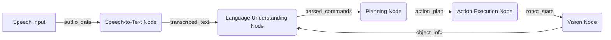

# Chapter 6: Orchestrating ROS 2 Actions for Autonomy

## Learning Objectives

By the end of this chapter, you will be able to:
- Integrate all VLA components using ROS 2 for unified system operation
- Implement behavior trees for coordinating complex robotic behaviors
- Design state machines for managing robot autonomy
- Coordinate multi-component systems through ROS 2 communication
- Handle resource allocation and task scheduling in robotic systems

## Introduction to ROS 2 Orchestration

ROS 2 orchestration serves as the backbone that integrates all Vision-Language-Action components into a unified autonomous system. Rather than having isolated systems for perception, language understanding, planning, and action execution, ROS 2 provides the communication infrastructure and coordination mechanisms needed for seamless operation.

The orchestration layer manages the flow of information between components, handles timing and synchronization challenges, and ensures that the system operates cohesively as a whole. This integration is essential for achieving true autonomy where the robot can respond to natural language commands while adapting to dynamic environments through visual feedback.

## ROS 2 Communication Patterns for VLA

### Publisher-Subscriber Pattern

The publisher-subscriber pattern is fundamental for data distribution in VLA systems:



```python
import rclpy
from rclpy.node import Node
from std_msgs.msg import String
from sensor_msgs.msg import Image, AudioData
from geometry_msgs.msg import PoseStamped
from vla_msgs.msg import ParsedCommand, ActionPlan, RobotState

class VLASubscriber(Node):
    def __init__(self):
        super().__init__('vla_subscriber')

        # Subscribers for different VLA components
        self.speech_sub = self.create_subscription(
            String,
            'vla/commands/text',
            self.speech_callback,
            10
        )

        self.vision_sub = self.create_subscription(
            Image,
            'camera/rgb/image_raw',
            self.vision_callback,
            10
        )

        self.state_sub = self.create_subscription(
            RobotState,
            'robot/state',
            self.state_callback,
            10
        )

        # Publishers for coordination
        self.command_pub = self.create_publisher(
            ParsedCommand,
            'vla/commands/parsed',
            10
        )

        self.plan_pub = self.create_publisher(
            ActionPlan,
            'vla/plans',
            10
        )

    def speech_callback(self, msg):
        """
        Handle incoming speech transcription
        """
        self.get_logger().info(f'Received speech: {msg.data}')
        # Process and forward for language understanding

    def vision_callback(self, msg):
        """
        Handle incoming vision data
        """
        self.get_logger().info(f'Received image with shape: {msg.height}x{msg.width}')
        # Process vision data

    def state_callback(self, msg):
        """
        Handle robot state updates
        """
        self.get_logger().info(f'Robot state: {msg.status}')
        # Update internal state for coordination

def main(args=None):
    rclpy.init(args=args)
    node = VLASubscriber()

    try:
        rclpy.spin(node)
    except KeyboardInterrupt:
        pass
    finally:
        node.destroy_node()
        rclpy.shutdown()
```

### Action-Based Communication

For long-running tasks, ROS 2 actions provide better feedback and control:

```python
import rclpy
from rclpy.action import ActionServer, GoalResponse, CancelResponse
from rclpy.node import Node
from vla_msgs.action import ExecuteVLAPlan  # Custom action definition
from vla_msgs.msg import ActionStep
import threading
import time

class VLAActionServer(Node):
    def __init__(self):
        super().__init__('vla_action_server')

        # Create action server for executing VLA plans
        self._action_server = ActionServer(
            self,
            ExecuteVLAPlan,
            'execute_vla_plan',
            self.execute_callback,
            goal_callback=self.goal_callback,
            cancel_callback=self.cancel_callback
        )

        # Component interfaces
        self.navigation_client = self.create_client(NavigateToPose, 'navigate_to_pose')
        self.manipulation_client = self.create_client(ManipulateObject, 'manipulate_object')
        self.vision_client = self.create_client(DetectObjects, 'detect_objects')

    def goal_callback(self, goal_request):
        """
        Accept or reject VLA plan execution goals
        """
        self.get_logger().info(f'Received VLA plan with {len(goal_request.plan.steps)} steps')
        return GoalResponse.ACCEPT

    def cancel_callback(self, goal_handle):
        """
        Accept or reject cancellation requests
        """
        self.get_logger().info('Received VLA plan cancellation request')
        return CancelResponse.ACCEPT

    async def execute_callback(self, goal_handle):
        """
        Execute the VLA plan with feedback
        """
        self.get_logger().info('Executing VLA plan')

        feedback_msg = ExecuteVLAPlan.Feedback()
        result = ExecuteVLAPlan.Result()

        plan = goal_handle.request.plan
        total_steps = len(plan.steps)

        for i, step in enumerate(plan.steps):
            if goal_handle.is_cancel_requested:
                goal_handle.canceled()
                result.success = False
                result.error_message = "Goal canceled"
                return result

            # Update feedback
            feedback_msg.current_step = i + 1
            feedback_msg.total_steps = total_steps
            feedback_msg.current_action = step.action_type
            goal_handle.publish_feedback(feedback_msg)

            # Execute the step
            success = await self.execute_action_step(step)

            if not success:
                goal_handle.abort()
                result.success = False
                result.error_message = f"Failed at step {i}: {step.action_type}"
                return result

            self.get_logger().info(f'Completed step {i+1}/{total_steps}: {step.action_type}')

        # Plan completed successfully
        goal_handle.succeed()
        result.success = True
        result.error_message = ""
        return result

    async def execute_action_step(self, step: ActionStep) -> bool:
        """
        Execute a single action step
        """
        if step.action_type == "NAVIGATE_TO":
            return await self.execute_navigation_step(step)
        elif step.action_type == "GRASP_OBJECT":
            return await self.execute_manipulation_step(step)
        elif step.action_type == "DETECT_OBJECTS":
            return await self.execute_vision_step(step)
        else:
            self.get_logger().error(f'Unknown action type: {step.action_type}')
            return False

    async def execute_navigation_step(self, step: ActionStep) -> bool:
        """
        Execute navigation step
        """
        goal = NavigateToPose.Goal()
        goal.pose = step.navigation_target

        future = self.navigation_client.call_async(goal)
        try:
            result = await future
            return result.success
        except Exception as e:
            self.get_logger().error(f'Navigation failed: {e}')
            return False

    async def execute_manipulation_step(self, step: ActionStep) -> bool:
        """
        Execute manipulation step
        """
        goal = ManipulateObject.Goal()
        goal.object_id = step.object_id
        goal.operation = step.manipulation_type

        future = self.manipulation_client.call_async(goal)
        try:
            result = await future
            return result.success
        except Exception as e:
            self.get_logger().error(f'Manipulation failed: {e}')
            return False

    async def execute_vision_step(self, step: ActionStep) -> bool:
        """
        Execute vision step
        """
        goal = DetectObjects.Goal()
        goal.target_class = step.object_class
        goal.search_area = step.search_region

        future = self.vision_client.call_async(goal)
        try:
            result = await future
            return len(result.detected_objects) > 0
        except Exception as e:
            self.get_logger().error(f'Vision detection failed: {e}')
            return False

def main(args=None):
    rclpy.init(args=args)
    server = VLAActionServer()

    try:
        rclpy.spin(server)
    except KeyboardInterrupt:
        pass
    finally:
        server.destroy_node()
        rclpy.shutdown()
```

## Behavior Trees for Complex Coordination

### Behavior Tree Fundamentals

Behavior trees provide a structured approach to coordinating complex robotic behaviors:

```python
from enum import Enum
from typing import List, Dict, Any, Optional
import asyncio

class NodeStatus(Enum):
    SUCCESS = "success"
    FAILURE = "failure"
    RUNNING = "running"

class BehaviorNode:
    def __init__(self, name: str):
        self.name = name
        self.status = NodeStatus.RUNNING

    async def tick(self) -> NodeStatus:
        """
        Execute one cycle of the behavior
        """
        raise NotImplementedError

class CompositeNode(BehaviorNode):
    def __init__(self, name: str, children: List[BehaviorNode]):
        super().__init__(name)
        self.children = children
        self.current_child_index = 0

class DecoratorNode(BehaviorNode):
    def __init__(self, name: str, child: BehaviorNode):
        super().__init__(name)
        self.child = child

# Control nodes
class SequenceNode(CompositeNode):
    """
    Execute children in sequence until one fails
    """
    async def tick(self) -> NodeStatus:
        for i, child in enumerate(self.children):
            status = await child.tick()

            if status == NodeStatus.FAILURE:
                self.current_child_index = 0
                return NodeStatus.FAILURE
            elif status == NodeStatus.RUNNING:
                self.current_child_index = i
                return NodeStatus.RUNNING

        self.current_child_index = 0
        return NodeStatus.SUCCESS

class SelectorNode(CompositeNode):
    """
    Try children until one succeeds
    """
    async def tick(self) -> NodeStatus:
        for i, child in enumerate(self.children):
            status = await child.tick()

            if status == NodeStatus.SUCCESS:
                self.current_child_index = 0
                return NodeStatus.SUCCESS
            elif status == NodeStatus.RUNNING:
                self.current_child_index = i
                return NodeStatus.RUNNING

        self.current_child_index = 0
        return NodeStatus.FAILURE

class ParallelNode(CompositeNode):
    """
    Execute multiple children in parallel
    """
    def __init__(self, name: str, children: List[BehaviorNode],
                 success_threshold: int = None, failure_threshold: int = 1):
        super().__init__(name, children)
        self.success_threshold = success_threshold or len(children)
        self.failure_threshold = failure_threshold

    async def tick(self) -> NodeStatus:
        success_count = 0
        failure_count = 0
        running_count = 0

        for child in self.children:
            status = await child.tick()

            if status == NodeStatus.SUCCESS:
                success_count += 1
            elif status == NodeStatus.FAILURE:
                failure_count += 1
            else:
                running_count += 1

        if success_count >= self.success_threshold:
            return NodeStatus.SUCCESS
        elif failure_count >= self.failure_threshold:
            return NodeStatus.FAILURE
        elif running_count > 0:
            return NodeStatus.RUNNING
        else:
            # All children finished but didn't meet success threshold
            return NodeStatus.FAILURE

# Decorator nodes
class InverterNode(DecoratorNode):
    """
    Invert the result of the child node
    """
    async def tick(self) -> NodeStatus:
        status = await self.child.tick()

        if status == NodeStatus.SUCCESS:
            return NodeStatus.FAILURE
        elif status == NodeStatus.FAILURE:
            return NodeStatus.SUCCESS
        else:
            return status

class RetryNode(DecoratorNode):
    """
    Retry the child node until it succeeds or max attempts reached
    """
    def __init__(self, name: str, child: BehaviorNode, max_attempts: int = 3):
        super().__init__(name, child)
        self.max_attempts = max_attempts
        self.attempt_count = 0

    async def tick(self) -> NodeStatus:
        while self.attempt_count < self.max_attempts:
            status = await self.child.tick()

            if status == NodeStatus.SUCCESS:
                self.attempt_count = 0
                return NodeStatus.SUCCESS
            elif status == NodeStatus.FAILURE:
                self.attempt_count += 1
                if self.attempt_count >= self.max_attempts:
                    self.attempt_count = 0
                    return NodeStatus.FAILURE
            else:
                return NodeStatus.RUNNING

        return NodeStatus.FAILURE

# Action nodes for VLA system
class NavigateActionNode(BehaviorNode):
    def __init__(self, name: str, target_location: str, ros2_interface: Any):
        super().__init__(name)
        self.target_location = target_location
        self.ros2_interface = ros2_interface
        self.navigation_active = False

    async def tick(self) -> NodeStatus:
        if not self.navigation_active:
            # Start navigation
            success = await self.ros2_interface.start_navigation(self.target_location)
            if success:
                self.navigation_active = True
                return NodeStatus.RUNNING
            else:
                return NodeStatus.FAILURE
        else:
            # Check navigation status
            status = await self.ros2_interface.get_navigation_status()
            if status == "arrived":
                self.navigation_active = False
                return NodeStatus.SUCCESS
            elif status == "failed":
                self.navigation_active = False
                return NodeStatus.FAILURE
            else:
                return NodeStatus.RUNNING

class DetectObjectActionNode(BehaviorNode):
    def __init__(self, name: str, object_class: str, ros2_interface: Any):
        super().__init__(name)
        self.object_class = object_class
        self.ros2_interface = ros2_interface

    async def tick(self) -> NodeStatus:
        detection_result = await self.ros2_interface.detect_object(self.object_class)
        if detection_result and detection_result.found:
            return NodeStatus.SUCCESS
        else:
            return NodeStatus.FAILURE

class GraspActionNode(BehaviorNode):
    def __init__(self, name: str, object_id: str, ros2_interface: Any):
        super().__init__(name)
        self.object_id = object_id
        self.ros2_interface = ros2_interface
        self.grasp_active = False

    async def tick(self) -> NodeStatus:
        if not self.grasp_active:
            # Start grasping
            success = await self.ros2_interface.start_grasp(self.object_id)
            if success:
                self.grasp_active = True
                return NodeStatus.RUNNING
            else:
                return NodeStatus.FAILURE
        else:
            # Check grasp status
            status = await self.ros2_interface.get_grasp_status()
            if status == "completed":
                self.grasp_active = False
                return NodeStatus.SUCCESS
            elif status == "failed":
                self.grasp_active = False
                return NodeStatus.FAILURE
            else:
                return NodeStatus.RUNNING
```

### VLA Behavior Tree Example

Create a behavior tree for a complex VLA task:

```python
class VLABehaviorTree:
    def __init__(self, ros2_interface: Any):
        self.ros2_interface = ros2_interface
        self.root = self.build_tree()

    def build_tree(self) -> BehaviorNode:
        """
        Build a behavior tree for VLA task execution
        """
        # Task: Go to kitchen, find red apple, grasp it, return to user

        # Sequence: All steps must succeed
        main_sequence = SequenceNode("Main_VLA_Sequence", [
            # Step 1: Navigate to kitchen
            NavigateActionNode("Navigate_to_Kitchen", "kitchen", self.ros2_interface),

            # Step 2: Detect red apple
            DetectObjectActionNode("Detect_Red_Apple", "red_apple", self.ros2_interface),

            # Step 3: Grasp the apple (with retry)
            RetryNode("Retry_Grasp",
                     GraspActionNode("Grasp_Apple", "red_apple_1", self.ros2_interface),
                     max_attempts=3),

            # Step 4: Return to user
            NavigateActionNode("Return_to_User", "user_location", self.ros2_interface)
        ])

        # Add fallback for navigation failures
        fallback_with_recovery = SelectorNode("Main_With_Fallback", [
            main_sequence,
            # Recovery behavior if main sequence fails
            SequenceNode("Recovery_Sequence", [
                NavigateActionNode("Go_to_Safe_Position", "safe_zone", self.ros2_interface),
                # Reset and restart
            ])
        ])

        return fallback_with_recovery

    async def run(self) -> NodeStatus:
        """
        Run the behavior tree
        """
        return await self.root.tick()

class VLAOrchestrationNode(Node):
    def __init__(self):
        super().__init__('vla_orchestration_node')

        # Initialize behavior tree
        self.behavior_tree = VLABehaviorTree(self)

        # Create action server for external requests
        self.vla_action_server = ActionServer(
            self,
            ExecuteVLAPlan,
            'vla/execute_plan',
            self.execute_vla_plan_callback
        )

    async def execute_vla_plan_callback(self, goal_handle):
        """
        Execute VLA plan using behavior tree
        """
        self.get_logger().info('Executing VLA plan via behavior tree')

        result = ExecuteVLAPlan.Result()

        # Run the behavior tree
        status = await self.behavior_tree.run()

        if status == NodeStatus.SUCCESS:
            goal_handle.succeed()
            result.success = True
            result.error_message = ""
        else:
            goal_handle.abort()
            result.success = False
            result.error_message = f"Behavior tree execution failed with status: {status.value}"

        return result

    # ROS 2 interface methods would be implemented here
    async def start_navigation(self, target_location: str) -> bool:
        # Implementation would interface with navigation stack
        pass

    async def get_navigation_status(self) -> str:
        # Implementation would check navigation status
        pass

    async def detect_object(self, object_class: str):
        # Implementation would interface with vision system
        pass

    async def start_grasp(self, object_id: str) -> bool:
        # Implementation would interface with manipulation system
        pass

    async def get_grasp_status(self) -> str:
        # Implementation would check manipulation status
        pass
```

## State Machines for Autonomy

### Hierarchical State Machines

State machines provide another approach to managing robot autonomy:

```python
from enum import Enum
import time

class RobotState(Enum):
    IDLE = "idle"
    LISTENING = "listening"
    UNDERSTANDING = "understanding"
    PLANNING = "planning"
    EXECUTING = "executing"
    ADJUSTING = "adjusting"
    COMPLETED = "completed"
    ERROR = "error"
    SAFETY = "safety"

class VLAStateMachine:
    def __init__(self):
        self.current_state = RobotState.IDLE
        self.previous_state = None
        self.state_start_time = time.time()
        self.command_queue = []
        self.current_command = None
        self.current_plan = None
        self.execution_step = 0

    def update(self):
        """
        Update the state machine based on current state and conditions
        """
        current_time = time.time()

        # Handle state transitions
        if self.current_state == RobotState.IDLE:
            if self.command_queue:
                self.current_command = self.command_queue.pop(0)
                self.transition_to(RobotState.LISTENING)

        elif self.current_state == RobotState.LISTENING:
            # Wait for speech input processing
            if self.is_speech_processed():
                self.transition_to(RobotState.UNDERSTANDING)

        elif self.current_state == RobotState.UNDERSTANDING:
            # Process the command
            success = self.process_command()
            if success:
                self.transition_to(RobotState.PLANNING)
            else:
                self.transition_to(RobotState.ERROR)

        elif self.current_state == RobotState.PLANNING:
            # Generate plan
            plan = self.generate_plan()
            if plan:
                self.current_plan = plan
                self.execution_step = 0
                self.transition_to(RobotState.EXECUTING)
            else:
                self.transition_to(RobotState.ERROR)

        elif self.current_state == RobotState.EXECUTING:
            # Execute current plan step
            if self.execution_step < len(self.current_plan):
                step_success = self.execute_plan_step(self.execution_step)
                if step_success:
                    self.execution_step += 1
                    if self.execution_step >= len(self.current_plan):
                        self.transition_to(RobotState.COMPLETED)
                else:
                    self.transition_to(RobotState.ADJUSTING)
            else:
                self.transition_to(RobotState.COMPLETED)

        elif self.current_state == RobotState.ADJUSTING:
            # Handle execution failure
            recovery_success = self.attempt_recovery()
            if recovery_success:
                self.transition_to(RobotState.EXECUTING)
            else:
                self.transition_to(RobotState.ERROR)

        elif self.current_state == RobotState.COMPLETED:
            # Task completed successfully
            if self.command_queue:
                self.transition_to(RobotState.IDLE)
            else:
                self.transition_to(RobotState.IDLE)

        elif self.current_state == RobotState.ERROR:
            # Handle error state
            self.handle_error()
            self.transition_to(RobotState.IDLE)

        elif self.current_state == RobotState.SAFETY:
            # Safety state - wait for clear conditions
            if self.is_safe_to_proceed():
                self.transition_to(self.previous_state or RobotState.IDLE)

    def transition_to(self, new_state: RobotState):
        """
        Transition to a new state with proper cleanup
        """
        self.previous_state = self.current_state
        self.current_state = new_state
        self.state_start_time = time.time()

        # Perform state entry actions
        self.on_state_enter(new_state)

    def on_state_enter(self, state: RobotState):
        """
        Actions to perform when entering a state
        """
        if state == RobotState.IDLE:
            self.get_logger().info("Robot is idle, waiting for commands")
        elif state == RobotState.LISTENING:
            self.get_logger().info("Robot is listening for speech input")
        elif state == RobotState.UNDERSTANDING:
            self.get_logger().info("Robot is processing command")
        elif state == RobotState.PLANNING:
            self.get_logger().info("Robot is generating execution plan")
        elif state == RobotState.EXECUTING:
            self.get_logger().info("Robot is executing plan")
        elif state == RobotState.ADJUSTING:
            self.get_logger().info("Robot is adjusting to unexpected conditions")
        elif state == RobotState.COMPLETED:
            self.get_logger().info("Robot has completed the task")
        elif state == RobotState.ERROR:
            self.get_logger().error("Robot encountered an error")
        elif state == RobotState.SAFETY:
            self.get_logger().warn("Robot is in safety mode")

    def is_speech_processed(self) -> bool:
        """
        Check if speech input has been processed
        """
        # Implementation would check speech processing status
        return True

    def process_command(self) -> bool:
        """
        Process the current command
        """
        # Implementation would interface with language understanding
        return True

    def generate_plan(self) -> Optional[List[Dict]]:
        """
        Generate execution plan for the command
        """
        # Implementation would interface with planning system
        return [{"action": "navigate_to", "params": {"location": "kitchen"}}]

    def execute_plan_step(self, step_index: int) -> bool:
        """
        Execute a single step of the plan
        """
        # Implementation would execute the specific action
        return True

    def attempt_recovery(self) -> bool:
        """
        Attempt to recover from execution failure
        """
        # Implementation would handle failure recovery
        return False

    def handle_error(self):
        """
        Handle error conditions
        """
        # Implementation would handle error recovery
        pass

    def is_safe_to_proceed(self) -> bool:
        """
        Check if it's safe to exit safety state
        """
        # Implementation would check safety conditions
        return True

    def get_logger(self):
        """
        Mock logger for example
        """
        class MockLogger:
            def info(self, msg):
                print(f"INFO: {msg}")
            def warn(self, msg):
                print(f"WARN: {msg}")
            def error(self, msg):
                print(f"ERROR: {msg}")
        return MockLogger()
```

## Resource Management and Scheduling

### Action Scheduling System

Manage concurrent tasks and resource allocation:

```python
import asyncio
from dataclasses import dataclass
from typing import Dict, List, Set
import heapq

@dataclass
class Task:
    id: str
    priority: int  # Lower number = higher priority
    action_type: str
    dependencies: List[str]
    resources_needed: Set[str]  # e.g., {"arm", "camera", "navigation"}
    estimated_duration: float
    creation_time: float

class ResourceScheduler:
    def __init__(self):
        self.task_queue = []  # Priority queue of tasks
        self.running_tasks = {}  # Currently executing tasks
        self.resource_owners = {}  # Which task owns which resource
        self.completed_tasks = set()
        self.failed_tasks = set()
        self.task_dependencies = {}  # Task -> set of dependent tasks

    def add_task(self, task: Task):
        """
        Add a task to the scheduler
        """
        # Check if all dependencies are satisfied
        unsatisfied_deps = [dep for dep in task.dependencies if dep not in self.completed_tasks and dep not in self.failed_tasks]

        if not unsatisfied_deps:
            # Add to queue if no unsatisfied dependencies
            heapq.heappush(self.task_queue, (task.priority, task.creation_time, task))
        else:
            # Store for later when dependencies are satisfied
            self.wait_for_dependencies(task, unsatisfied_deps)

    def wait_for_dependencies(self, task: Task, dependencies: List[str]):
        """
        Wait for dependencies to be satisfied
        """
        for dep in dependencies:
            if dep not in self.task_dependencies:
                self.task_dependencies[dep] = set()
            self.task_dependencies[dep].add(task.id)

    def allocate_resources(self, task: Task) -> bool:
        """
        Allocate resources for a task
        """
        available_resources = self.get_available_resources()
        needed_resources = task.resources_needed

        if needed_resources.issubset(available_resources):
            # Allocate resources
            for resource in needed_resources:
                self.resource_owners[resource] = task.id
            return True
        else:
            return False

    def get_available_resources(self) -> Set[str]:
        """
        Get currently available resources
        """
        all_resources = {"arm", "camera", "navigation", "gripper", "lidar", "microphone"}
        busy_resources = set(self.resource_owners.values())
        return all_resources - busy_resources

    def release_resources(self, task: Task):
        """
        Release resources allocated to a task
        """
        for resource in task.resources_needed:
            if self.resource_owners.get(resource) == task.id:
                del self.resource_owners[resource]

    def schedule_next_task(self) -> Optional[Task]:
        """
        Schedule the next available task
        """
        if not self.task_queue:
            return None

        # Get highest priority task
        priority, creation_time, task = heapq.heappop(self.task_queue)

        # Try to allocate resources
        if self.allocate_resources(task):
            # Start the task
            self.running_tasks[task.id] = task
            return task
        else:
            # Put back in queue to try later
            heapq.heappush(self.task_queue, (priority, creation_time, task))
            return None

    def complete_task(self, task_id: str, success: bool):
        """
        Mark a task as completed
        """
        task = self.running_tasks.pop(task_id, None)
        if task:
            self.release_resources(task)

            if success:
                self.completed_tasks.add(task_id)
            else:
                self.failed_tasks.add(task_id)

            # Check if any waiting tasks can now run
            self.check_dependent_tasks(task_id)

    def check_dependent_tasks(self, completed_task_id: str):
        """
        Check if any tasks were waiting for this task to complete
        """
        if completed_task_id in self.task_dependencies:
            dependent_tasks = self.task_dependencies[completed_task_id]

            for task_id in list(dependent_tasks):  # Make a copy to iterate safely
                # Find the task in waiting queues and check if all dependencies are now satisfied
                # This is a simplified version - in practice you'd need to track waiting tasks separately
                pass

class VLAExecutionManager:
    def __init__(self):
        self.scheduler = ResourceScheduler()
        self.ros2_interface = None  # Interface to ROS 2 system

    def submit_vla_plan(self, plan: List[Dict], priority: int = 5) -> str:
        """
        Submit a VLA plan for execution
        """
        plan_id = f"plan_{int(time.time())}"

        # Convert plan steps to tasks
        for i, step in enumerate(plan):
            task_id = f"{plan_id}_step_{i}"
            task = self.create_task_from_step(step, task_id, priority, plan_id)
            self.scheduler.add_task(task)

        return plan_id

    def create_task_from_step(self, step: Dict, task_id: str, priority: int, plan_id: str) -> Task:
        """
        Create a Task object from a plan step
        """
        # Determine resources needed based on action type
        resources = self.get_resources_for_action(step["action"])

        # Determine dependencies (simplified)
        dependencies = []
        if "depends_on" in step:
            dependencies.append(step["depends_on"])

        return Task(
            id=task_id,
            priority=priority,
            action_type=step["action"],
            dependencies=dependencies,
            resources_needed=resources,
            estimated_duration=self.estimate_duration(step["action"]),
            creation_time=time.time()
        )

    def get_resources_for_action(self, action_type: str) -> Set[str]:
        """
        Determine which resources are needed for an action
        """
        resource_map = {
            "navigate_to": {"navigation"},
            "grasp_object": {"arm", "gripper", "camera"},
            "place_object": {"arm", "gripper"},
            "search_object": {"camera", "navigation"},
            "detect_objects": {"camera"},
            "move_arm": {"arm"},
            "open_gripper": {"gripper"},
            "close_gripper": {"gripper"}
        }
        return resource_map.get(action_type, set())

    def estimate_duration(self, action_type: str) -> float:
        """
        Estimate duration for an action
        """
        duration_map = {
            "navigate_to": 10.0,  # seconds
            "grasp_object": 5.0,
            "place_object": 3.0,
            "search_object": 15.0,
            "detect_objects": 2.0,
            "move_arm": 4.0,
            "open_gripper": 1.0,
            "close_gripper": 1.0
        }
        return duration_map.get(action_type, 5.0)
```

## Multi-Component Coordination

### Coordination Manager

Coordinate between different VLA system components:

```python
class VLAComponentManager:
    def __init__(self):
        self.components = {
            "speech": {"status": "idle", "last_update": time.time()},
            "language": {"status": "idle", "last_update": time.time()},
            "planning": {"status": "idle", "last_update": time.time()},
            "vision": {"status": "idle", "last_update": time.time()},
            "manipulation": {"status": "idle", "last_update": time.time()},
            "navigation": {"status": "idle", "last_update": time.time()}
        }

        self.component_interfaces = {}
        self.active_requests = {}
        self.coordination_state = {}

    def register_component(self, name: str, interface: Any):
        """
        Register a component with the coordination manager
        """
        self.component_interfaces[name] = interface

    def request_component_action(self, component: str, action: str, params: Dict) -> str:
        """
        Request an action from a component
        """
        if component not in self.component_interfaces:
            raise ValueError(f"Component {component} not registered")

        # Check if component is available
        if self.components[component]["status"] != "idle":
            # Handle busy component (queue, reject, etc.)
            return self.handle_busy_component(component, action, params)

        # Mark component as busy
        self.components[component]["status"] = "busy"

        # Generate request ID
        request_id = f"{component}_{action}_{int(time.time() * 1000)}"

        # Store request
        self.active_requests[request_id] = {
            "component": component,
            "action": action,
            "params": params,
            "timestamp": time.time(),
            "status": "pending"
        }

        # Execute action asynchronously
        asyncio.create_task(self.execute_component_action(request_id))

        return request_id

    async def execute_component_action(self, request_id: str):
        """
        Execute an action on a component
        """
        request = self.active_requests[request_id]
        component = request["component"]
        action = request["action"]
        params = request["params"]

        try:
            # Call the component interface
            interface = self.component_interfaces[component]

            # This assumes the interface has methods named after actions
            method_name = f"execute_{action.replace(' ', '_')}"
            if hasattr(interface, method_name):
                method = getattr(interface, method_name)
                result = await method(params)

                # Update request status
                request["status"] = "completed"
                request["result"] = result
                request["success"] = True
            else:
                request["status"] = "failed"
                request["error"] = f"Action {action} not supported by {component}"
                request["success"] = False

        except Exception as e:
            request["status"] = "failed"
            request["error"] = str(e)
            request["success"] = False

        finally:
            # Mark component as idle
            self.components[component]["status"] = "idle"
            self.components[component]["last_update"] = time.time()

    def handle_busy_component(self, component: str, action: str, params: Dict) -> str:
        """
        Handle request when component is busy
        """
        # For simplicity, just wait and retry
        # In practice, you might want to queue, use alternative, or return error
        request_id = f"{component}_{action}_queued_{int(time.time() * 1000)}"

        # Add to queue
        if "queue" not in self.coordination_state:
            self.coordination_state["queue"] = []

        self.coordination_state["queue"].append({
            "request_id": request_id,
            "component": component,
            "action": action,
            "params": params
        })

        return request_id

    def get_component_status(self, component: str) -> Dict:
        """
        Get status of a component
        """
        if component in self.components:
            return self.components[component]
        else:
            return {"status": "unknown", "last_update": 0}

    def get_coordination_state(self) -> Dict:
        """
        Get overall coordination state
        """
        return {
            "component_status": self.components,
            "active_requests": len(self.active_requests),
            "queued_requests": len(self.coordination_state.get("queue", []))
        }
```

## Integration with ROS 2 Ecosystem

### Orchestration Launch System

Create launch files for the complete VLA orchestration:

```python
from launch import LaunchDescription
from launch_ros.actions import Node
from launch.actions import DeclareLaunchArgument
from launch.substitutions import LaunchConfiguration
from launch.conditions import IfCondition

def generate_launch_description():
    # Declare launch arguments
    use_sim_time = LaunchConfiguration('use_sim_time', default='false')
    robot_namespace = LaunchConfiguration('robot_namespace', default='')

    return LaunchDescription([
        # Declare launch arguments
        DeclareLaunchArgument(
            'use_sim_time',
            default_value='false',
            description='Use simulation time'
        ),
        DeclareLaunchArgument(
            'robot_namespace',
            default_value='',
            description='Robot namespace'
        ),

        # VLA orchestration node
        Node(
            package='vla_orchestration',
            executable='vla_orchestration_node',
            name='vla_orchestration',
            parameters=[
                {'use_sim_time': use_sim_time},
                {'robot_namespace': robot_namespace}
            ],
            remappings=[
                ('/vla/commands/text', '/speech_to_text/transcription'),
                ('/vla/plans', '/planning/generated_plan'),
                ('/robot/state', '/robot_state_publisher/robot_description')
            ]
        ),

        # Speech-to-text node
        Node(
            package='vla_speech',
            executable='whisper_stt_node',
            name='whisper_stt',
            parameters=[
                {'model_size': 'base'},
                {'language': 'en'},
                {'sample_rate': 16000}
            ],
            condition=IfCondition(LaunchConfiguration('enable_speech', default='true'))
        ),

        # Language understanding node
        Node(
            package='vla_language',
            executable='language_understanding_node',
            name='language_understanding',
            parameters=[
                {'enable_fallback_parsing': True}
            ],
            condition=IfCondition(LaunchConfiguration('enable_language', default='true'))
        ),

        # Planning node
        Node(
            package='vla_planning',
            executable='llm_planning_node',
            name='llm_planning',
            parameters=[
                {'model_name': 'gpt-3.5-turbo'},
                {'max_planning_time': 10.0}
            ],
            condition=IfCondition(LaunchConfiguration('enable_planning', default='true'))
        ),

        # Vision processing node
        Node(
            package='vla_vision',
            executable='vision_processing_node',
            name='vision_processing',
            parameters=[
                {'detection_threshold': 0.7},
                {'tracking_enabled': True}
            ],
            condition=IfCondition(LaunchConfiguration('enable_vision', default='true'))
        )
    ])
```

### Service-Based Coordination

Implement coordination through ROS 2 services:

```python
import rclpy
from rclpy.node import Node
from rclpy.callback_groups import ReentrantCallbackGroup
from rclpy.executors import MultiThreadedExecutor
from vla_msgs.srv import CoordinateAction, SystemStatus
from vla_msgs.msg import ComponentStatus

class VLAServiceCoordinator(Node):
    def __init__(self):
        super().__init__('vla_service_coordinator')

        # Create services for coordination
        self.coordination_service = self.create_service(
            CoordinateAction,
            'vla/coordinate_action',
            self.coordinate_action_callback,
            callback_group=ReentrantCallbackGroup()
        )

        self.status_service = self.create_service(
            SystemStatus,
            'vla/system_status',
            self.get_system_status_callback,
            callback_group=ReentrantCallbackGroup()
        )

        # Create clients for component services
        self.component_clients = {}
        self.initialize_component_clients()

        # Publisher for coordination updates
        self.coordination_pub = self.create_publisher(
            ComponentStatus,
            'vla/coordination_status',
            10
        )

    def initialize_component_clients(self):
        """
        Initialize clients for all VLA components
        """
        component_services = {
            'speech': 'speech_to_text/process_audio',
            'language': 'language_understanding/parse_command',
            'planning': 'planning/generate_plan',
            'vision': 'vision/detect_objects',
            'manipulation': 'manipulation/grasp_object',
            'navigation': 'navigation/go_to_pose'
        }

        for component, service_name in component_services.items():
            client = self.create_client(
                self.get_service_type(service_name),
                service_name,
                callback_group=ReentrantCallbackGroup()
            )
            self.component_clients[component] = client

    def get_service_type(self, service_name: str):
        """
        Get the service type based on service name
        """
        # This would return the appropriate service type
        # based on the service name
        from example_interfaces.srv import Trigger
        return Trigger  # Placeholder

    def coordinate_action_callback(self, request, response):
        """
        Coordinate an action across multiple components
        """
        self.get_logger().info(f'Coordinating action: {request.action_type}')

        try:
            # Validate action request
            if not self.validate_action_request(request):
                response.success = False
                response.message = "Invalid action request"
                return response

            # Check component availability
            available_components = self.check_component_availability(request.required_components)
            if not available_components:
                response.success = False
                response.message = "Required components not available"
                return response

            # Execute coordinated action
            execution_result = self.execute_coordinated_action(request)

            response.success = execution_result['success']
            response.message = execution_result['message']
            response.execution_time = execution_result['execution_time']

        except Exception as e:
            self.get_logger().error(f'Coordination error: {e}')
            response.success = False
            response.message = f"Coordination failed: {str(e)}"

        return response

    def validate_action_request(self, request) -> bool:
        """
        Validate the action request
        """
        # Check if required components are specified
        if not request.required_components:
            return False

        # Check if action type is supported
        supported_actions = [
            'fetch_object', 'navigate_and_report', 'manipulate_and_verify',
            'search_and_grasp', 'transport_object'
        ]

        return request.action_type in supported_actions

    def check_component_availability(self, required_components: List[str]) -> bool:
        """
        Check if required components are available
        """
        for component in required_components:
            if component not in self.component_clients:
                return False

            client = self.component_clients[component]
            if not client.service_is_ready():
                return False

        return True

    def execute_coordinated_action(self, request) -> Dict:
        """
        Execute a coordinated action across multiple components
        """
        start_time = time.time()

        try:
            # Execute action steps in sequence
            for step in request.action_sequence:
                step_result = self.execute_action_step(step)
                if not step_result['success']:
                    return {
                        'success': False,
                        'message': f"Step failed: {step_result['message']}",
                        'execution_time': time.time() - start_time
                    }

            return {
                'success': True,
                'message': 'Action completed successfully',
                'execution_time': time.time() - start_time
            }

        except Exception as e:
            return {
                'success': False,
                'message': f"Execution failed: {str(e)}",
                'execution_time': time.time() - start_time
            }

    def execute_action_step(self, step) -> Dict:
        """
        Execute a single action step
        """
        component = step.component
        action = step.action
        params = step.parameters

        if component in self.component_clients:
            client = self.component_clients[component]

            # Create and call service request
            request = self.create_service_request(action, params)

            # Wait for service response
            if client.wait_for_service(timeout_sec=1.0):
                future = client.call_async(request)
                # In a real implementation, you'd await the future
                # For this example, return success
                return {'success': True, 'message': 'Step completed'}
            else:
                return {'success': False, 'message': f'Service {component} not available'}
        else:
            return {'success': False, 'message': f'Component {component} not found'}

    def get_system_status_callback(self, request, response):
        """
        Get overall system status
        """
        response.components = list(self.component_clients.keys())
        response.status = [self.get_component_status(comp) for comp in self.component_clients.keys()]
        response.overall_status = self.calculate_overall_status()

        return response

    def get_component_status(self, component: str) -> str:
        """
        Get status of a specific component
        """
        client = self.component_clients[component]
        if client.service_is_ready():
            return "available"
        else:
            return "unavailable"

    def calculate_overall_status(self) -> str:
        """
        Calculate overall system status
        """
        available_count = sum(1 for comp in self.component_clients.values() if comp.service_is_ready())
        total_count = len(self.component_clients)

        if available_count == total_count:
            return "operational"
        elif available_count == 0:
            return "offline"
        else:
            return "degraded"

def main(args=None):
    rclpy.init(args=args)

    node = VLAServiceCoordinator()
    executor = MultiThreadedExecutor()
    executor.add_node(node)

    try:
        executor.spin()
    except KeyboardInterrupt:
        pass
    finally:
        node.destroy_node()
        rclpy.shutdown()
```

## Performance Monitoring and Optimization

### Coordination Performance Tracking

Monitor and optimize the orchestration system:

```python
import time
from collections import defaultdict, deque
import statistics

class PerformanceMonitor:
    def __init__(self):
        self.metrics = defaultdict(lambda: deque(maxlen=100))  # Keep last 100 samples
        self.start_times = {}
        self.active_measurements = set()

    def start_measurement(self, metric_name: str, identifier: str = "default"):
        """
        Start timing a specific operation
        """
        key = f"{metric_name}_{identifier}"
        self.start_times[key] = time.time()
        self.active_measurements.add(key)

    def end_measurement(self, metric_name: str, identifier: str = "default"):
        """
        End timing and record the measurement
        """
        key = f"{metric_name}_{identifier}"

        if key in self.start_times and key in self.active_measurements:
            elapsed = time.time() - self.start_times[key]
            self.metrics[metric_name].append(elapsed)
            self.active_measurements.remove(key)
            del self.start_times[key]

    def get_average(self, metric_name: str) -> float:
        """
        Get average value for a metric
        """
        if self.metrics[metric_name]:
            return statistics.mean(self.metrics[metric_name])
        return 0.0

    def get_percentile(self, metric_name: str, percentile: float) -> float:
        """
        Get percentile value for a metric
        """
        if self.metrics[metric_name]:
            sorted_values = sorted(self.metrics[metric_name])
            index = int(len(sorted_values) * percentile / 100)
            return sorted_values[min(index, len(sorted_values) - 1)]
        return 0.0

    def get_statistics(self) -> Dict[str, Dict[str, float]]:
        """
        Get comprehensive statistics
        """
        stats = {}
        for metric_name, values in self.metrics.items():
            if values:
                stats[metric_name] = {
                    'average': statistics.mean(values),
                    'median': statistics.median(values),
                    'min': min(values),
                    'max': max(values),
                    'std_dev': statistics.stdev(values) if len(values) > 1 else 0.0,
                    'count': len(values),
                    'p95': self.get_percentile(metric_name, 95),
                    'p99': self.get_percentile(metric_name, 99)
                }
        return stats

class OptimizedVLAOrchestrator:
    def __init__(self):
        self.performance_monitor = PerformanceMonitor()
        self.component_manager = VLAComponentManager()
        self.resource_scheduler = ResourceScheduler()
        self.behavior_tree = None
        self.state_machine = VLAStateMachine()

    async def execute_vla_command(self, command: str) -> Dict:
        """
        Execute a VLA command with performance monitoring
        """
        self.performance_monitor.start_measurement("command_execution", command[:10])

        try:
            # Track each phase
            self.performance_monitor.start_measurement("language_processing")
            parsed_command = await self.process_language(command)
            self.performance_monitor.end_measurement("language_processing")

            self.performance_monitor.start_measurement("planning")
            plan = await self.generate_plan(parsed_command)
            self.performance_monitor.end_measurement("planning")

            self.performance_monitor.start_measurement("execution")
            execution_result = await self.execute_plan(plan)
            self.performance_monitor.end_measurement("execution")

            result = {
                'success': execution_result['success'],
                'command': command,
                'execution_time': time.time() - self.performance_monitor.start_times.get(f"command_execution_{command[:10]}", time.time()),
                'breakdown': {
                    'language_time': self.performance_monitor.get_average("language_processing"),
                    'planning_time': self.performance_monitor.get_average("planning"),
                    'execution_time': self.performance_monitor.get_average("execution")
                }
            }

            return result

        except Exception as e:
            return {
                'success': False,
                'command': command,
                'error': str(e),
                'breakdown': {}
            }
        finally:
            self.performance_monitor.end_measurement("command_execution", command[:10])

    async def process_language(self, command: str):
        """
        Process language with monitoring
        """
        # Implementation would call language understanding component
        await asyncio.sleep(0.1)  # Simulate processing time
        return {"action": "fetch", "object": "red_apple", "location": "kitchen"}

    async def generate_plan(self, parsed_command: Dict):
        """
        Generate plan with monitoring
        """
        # Implementation would call planning component
        await asyncio.sleep(0.2)  # Simulate planning time
        return [{"action": "navigate_to", "params": {"location": "kitchen"}}]

    async def execute_plan(self, plan: List[Dict]) -> Dict:
        """
        Execute plan with monitoring
        """
        # Implementation would execute the plan
        await asyncio.sleep(0.5)  # Simulate execution time
        return {"success": True, "steps_completed": len(plan)}

    def get_performance_report(self) -> str:
        """
        Get a formatted performance report
        """
        stats = self.performance_monitor.get_statistics()

        report = "VLA System Performance Report\n"
        report += "=" * 30 + "\n"

        for metric, values in stats.items():
            report += f"\n{metric.upper()}:\n"
            report += f"  Average: {values['average']:.3f}s\n"
            report += f"  Median:  {values['median']:.3f}s\n"
            report += f"  Min:     {values['min']:.3f}s\n"
            report += f"  Max:     {values['max']:.3f}s\n"
            report += f"  P95:     {values['p95']:.3f}s\n"
            report += f"  P99:     {values['p99']:.3f}s\n"
            report += f"  Samples: {values['count']}\n"

        return report
```

## Summary

ROS 2 orchestration provides the essential coordination layer that integrates all Vision-Language-Action components into a unified autonomous system. Through publisher-subscriber patterns, action-based communication, behavior trees, state machines, and resource scheduling, the orchestration system manages the complex interactions between perception, language understanding, planning, and action execution.

The key aspects of effective ROS 2 orchestration include:
1. Proper communication patterns between components
2. Behavior trees for complex task coordination
3. State machines for managing autonomy
4. Resource management for concurrent operations
5. Performance monitoring and optimization
6. Service-based coordination for system-wide operations

## Exercises

1. Implement a behavior tree that coordinates fetching an object from one room to another
2. Create a state machine that handles the complete VLA pipeline from speech input to action execution
3. Design a resource scheduler that manages concurrent navigation and manipulation tasks
4. Build a performance monitoring system that tracks coordination efficiency

## Further Reading

- [ROS 2 Design Concepts](https://design.ros2.org/) - Official ROS 2 design documentation
- [Behavior Trees in Robotics](https://arxiv.org/abs/1709.00084) - Comprehensive guide to behavior trees
- [Multi-Robot Coordination](https://arxiv.org/abs/2003.04620) - Coordination strategies for robotic systems
- [Real-Time ROS 2](https://arxiv.org/abs/2102.07413) - Performance optimization in ROS 2 systems