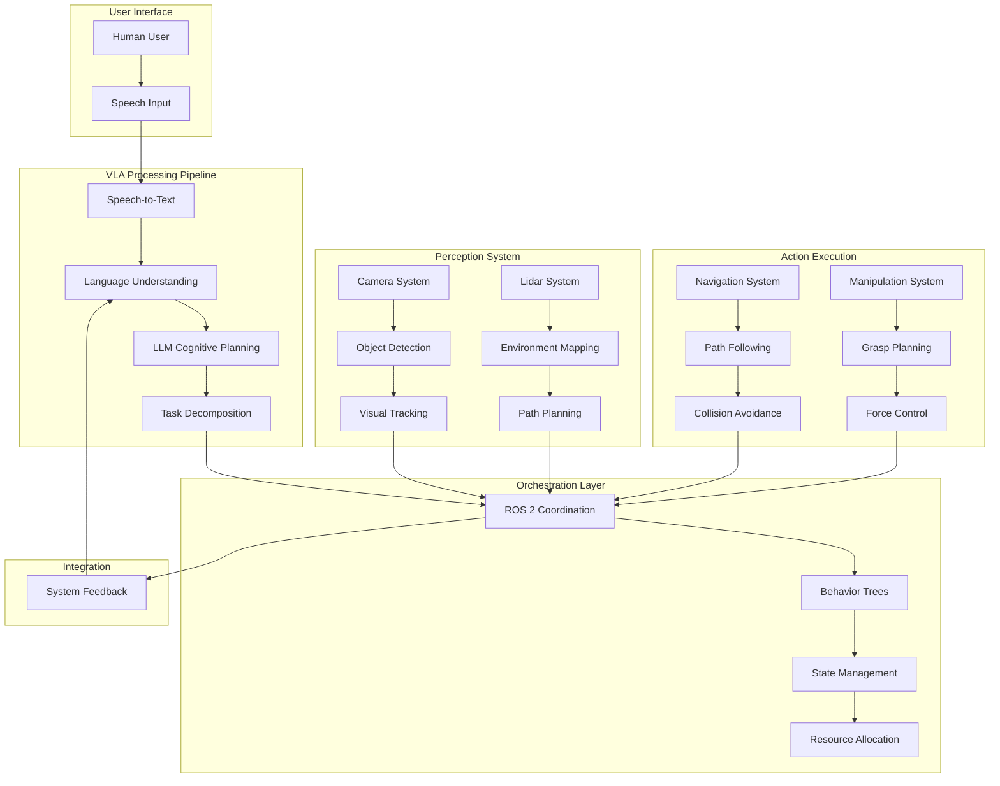

# Chapter 7: Capstone - The Autonomous Humanoid

## Learning Objectives

By the end of this chapter, you will be able to:
- Integrate all VLA components into a complete autonomous humanoid system
- Implement end-to-end examples combining all previous modules
- Design debugging and testing strategies for integrated systems
- Evaluate system performance and identify improvement opportunities
- Deploy and operate a complete VLA-based robotic system

## Introduction to the Complete Autonomous System

The capstone chapter brings together all the components developed throughout the Vision-Language-Action module to create a complete autonomous humanoid system. This integration represents the culmination of the VLA paradigm, where speech processing, language understanding, cognitive planning, vision-guided action, and ROS 2 orchestration work in harmony to enable natural human-robot interaction.

The autonomous humanoid system demonstrates the power of the integrated approach, allowing robots to understand complex natural language commands, navigate dynamic environments, manipulate objects, and adapt to changing conditions while maintaining safety and efficiency.

## System Architecture Overview

### Complete VLA System Architecture



### Component Integration Points

The complete system integrates components from all previous chapters:

1. **Speech Processing** (Chapter 2): Converts natural language to text
2. **Language Understanding** (Chapter 3): Parses commands and decomposes tasks
3. **Cognitive Planning** (Chapter 4): Generates high-level strategies
4. **Vision-Guided Action** (Chapter 5): Provides perception and manipulation
5. **ROS 2 Orchestration** (Chapter 6): Coordinates all components

## End-to-End Implementation

### Complete System Node

Implement the main integration node that coordinates all components:

```python
import rclpy
from rclpy.node import Node
from rclpy.action import ActionServer, GoalResponse
from rclpy.callback_groups import ReentrantCallbackGroup
from rclpy.executors import MultiThreadedExecutor
from std_msgs.msg import String
from sensor_msgs.msg import Image, PointCloud2
from geometry_msgs.msg import PoseStamped
from vla_msgs.action import ExecuteAutonomousTask
from vla_msgs.msg import ParsedCommand, ActionPlan, RobotState
from vla_msgs.srv import SystemStatus, CoordinateAction
import asyncio
import threading
from typing import Dict, List, Optional
import time

class AutonomousHumanoidSystem(Node):
    def __init__(self):
        super().__init__('autonomous_humanoid_system')

        # Initialize all component interfaces
        self.initialize_component_interfaces()

        # Create main action server for autonomous tasks
        self.autonomous_task_server = ActionServer(
            self,
            ExecuteAutonomousTask,
            'execute_autonomous_task',
            self.execute_autonomous_task_callback,
            callback_group=ReentrantCallbackGroup(),
            goal_callback=self.goal_callback,
            cancel_callback=self.cancel_callback
        )

        # Create service for system status
        self.status_service = self.create_service(
            SystemStatus,
            'humanoid_system/status',
            self.get_system_status_callback,
            callback_group=ReentrantCallbackGroup()
        )

        # Create service for coordination
        self.coordination_service = self.create_service(
            CoordinateAction,
            'humanoid_system/coordinate',
            self.coordinate_action_callback,
            callback_group=ReentrantCallbackGroup()
        )

        # Publishers for system state
        self.state_publisher = self.create_publisher(
            RobotState,
            'humanoid_system/state',
            10
        )

        # Initialize system state
        self.system_state = {
            'initialized': False,
            'components_ready': False,
            'current_task': None,
            'task_progress': 0.0,
            'last_error': None,
            'performance_metrics': {}
        }

        # Start system initialization
        self.initialize_system()

    def initialize_component_interfaces(self):
        """
        Initialize interfaces to all VLA components
        """
        # Speech-to-text interface
        self.speech_client = self.create_client(
            self.get_service_type('speech_to_text/process'),
            'speech_to_text/process',
            callback_group=ReentrantCallbackGroup()
        )

        # Language understanding interface
        self.language_client = self.create_client(
            self.get_service_type('language_understanding/parse'),
            'language_understanding/parse',
            callback_group=ReentrantCallbackGroup()
        )

        # Planning interface
        self.planning_client = self.create_client(
            self.get_service_type('planning/generate'),
            'planning/generate',
            callback_group=ReentrantCallbackGroup()
        )

        # Vision interface
        self.vision_client = self.create_client(
            self.get_service_type('vision/detect'),
            'vision/detect',
            callback_group=ReentrantCallbackGroup()
        )

        # Navigation interface
        self.navigation_client = self.create_client(
            self.get_service_type('navigation/go_to'),
            'navigation/go_to',
            callback_group=ReentrantCallbackGroup()
        )

        # Manipulation interface
        self.manipulation_client = self.create_client(
            self.get_service_type('manipulation/grasp'),
            'manipulation/grasp',
            callback_group=ReentrantCallbackGroup()
        )

    def initialize_system(self):
        """
        Initialize the complete autonomous system
        """
        self.get_logger().info('Initializing autonomous humanoid system...')

        # Check if all components are available
        all_ready = True
        timeout = time.time() + 30.0  # 30 second timeout

        while time.time() < timeout and all_ready:
            # Check each component
            components = [
                ('Speech', self.speech_client),
                ('Language', self.language_client),
                ('Planning', self.planning_client),
                ('Vision', self.vision_client),
                ('Navigation', self.navigation_client),
                ('Manipulation', self.manipulation_client)
            ]

            all_ready = True
            for name, client in components:
                if not client.service_is_ready():
                    all_ready = False
                    self.get_logger().warn(f'{name} component not ready yet...')
                    break

            if not all_ready:
                time.sleep(1.0)

        if all_ready:
            self.system_state['components_ready'] = True
            self.system_state['initialized'] = True
            self.get_logger().info('Autonomous humanoid system initialized successfully!')
        else:
            self.system_state['initialized'] = False
            self.get_logger().error('Failed to initialize autonomous humanoid system - some components unavailable')

    def goal_callback(self, goal_request):
        """
        Handle autonomous task goal requests
        """
        self.get_logger().info(f'Received autonomous task: {goal_request.task_description}')

        if not self.system_state['initialized']:
            self.get_logger().error('System not initialized, rejecting task')
            return GoalResponse.REJECT

        return GoalResponse.ACCEPT

    def cancel_callback(self, goal_handle):
        """
        Handle task cancellation
        """
        self.get_logger().info('Received task cancellation request')
        return rclpy.action.CancelResponse.ACCEPT

    async def execute_autonomous_task_callback(self, goal_handle):
        """
        Execute an autonomous task end-to-end
        """
        self.get_logger().info(f'Executing autonomous task: {goal_handle.request.task_description}')

        # Initialize result
        result = ExecuteAutonomousTask.Result()
        feedback_msg = ExecuteAutonomousTask.Feedback()

        try:
            # Update system state
            self.system_state['current_task'] = goal_handle.request.task_description
            self.system_state['task_progress'] = 0.0

            # Step 1: Process natural language command
            feedback_msg.status = "Processing natural language command"
            feedback_msg.progress = 0.1
            goal_handle.publish_feedback(feedback_msg)

            parsed_command = await self.process_language_command(goal_handle.request.task_description)
            if not parsed_command:
                result.success = False
                result.error_message = "Failed to parse language command"
                goal_handle.abort()
                return result

            # Step 2: Generate execution plan
            feedback_msg.status = "Generating execution plan"
            feedback_msg.progress = 0.3
            goal_handle.publish_feedback(feedback_msg)

            plan = await self.generate_execution_plan(parsed_command)
            if not plan or not plan.steps:
                result.success = False
                result.error_message = "Failed to generate execution plan"
                goal_handle.abort()
                return result

            # Step 3: Execute the plan with monitoring
            feedback_msg.status = "Executing plan"
            feedback_msg.progress = 0.5
            goal_handle.publish_feedback(feedback_msg)

            execution_result = await self.execute_plan_with_monitoring(plan, goal_handle, feedback_msg)

            # Finalize result
            result.success = execution_result['success']
            result.error_message = execution_result.get('error', '')
            result.execution_time = execution_result.get('execution_time', 0.0)

            if result.success:
                goal_handle.succeed()
            else:
                goal_handle.abort()

        except Exception as e:
            self.get_logger().error(f'Autonomous task execution failed: {e}')
            result.success = False
            result.error_message = f"Execution failed: {str(e)}"
            goal_handle.abort()

        finally:
            # Update system state
            self.system_state['current_task'] = None
            self.system_state['task_progress'] = 0.0

        return result

    async def process_language_command(self, command: str) -> Optional[Dict]:
        """
        Process a natural language command through the complete pipeline
        """
        try:
            # Call speech-to-text service (if command is audio, otherwise skip)
            if hasattr(command, 'audio_data'):
                speech_request = self.create_service_request('speech_to_text/process', {'audio': command.audio_data})
                speech_response = await self.speech_client.call_async(speech_request)
                text_command = speech_response.text
            else:
                text_command = command

            # Call language understanding service
            lang_request = self.create_service_request('language_understanding/parse', {'command': text_command})
            lang_response = await self.language_client.call_async(lang_request)

            return {
                'command': text_command,
                'parsed': lang_response.parsed_command,
                'intent': lang_response.intent,
                'entities': lang_response.entities,
                'confidence': lang_response.confidence
            }

        except Exception as e:
            self.get_logger().error(f'Language processing failed: {e}')
            return None

    async def generate_execution_plan(self, parsed_command: Dict) -> Optional[Dict]:
        """
        Generate an execution plan using the planning system
        """
        try:
            planning_request = self.create_service_request('planning/generate', {
                'command': parsed_command['command'],
                'intent': parsed_command['intent'],
                'entities': parsed_command['entities']
            })

            planning_response = await self.planning_client.call_async(planning_request)

            return {
                'steps': planning_response.action_plan,
                'estimated_time': planning_response.estimated_time,
                'confidence': planning_response.confidence
            }

        except Exception as e:
            self.get_logger().error(f'Plan generation failed: {e}')
            return None

    async def execute_plan_with_monitoring(self, plan: Dict, goal_handle, feedback_msg) -> Dict:
        """
        Execute a plan with continuous monitoring and feedback
        """
        start_time = time.time()
        total_steps = len(plan['steps'])

        for i, step in enumerate(plan['steps']):
            if goal_handle.is_cancel_requested:
                return {'success': False, 'error': 'Task canceled'}

            # Update feedback
            feedback_msg.status = f"Executing step {i+1}/{total_steps}: {step['action']}"
            feedback_msg.progress = 0.5 + (0.4 * (i + 1) / total_steps)
            goal_handle.publish_feedback(feedback_msg)

            # Execute the step
            step_success = await self.execute_single_step(step)

            if not step_success:
                return {
                    'success': False,
                    'error': f'Step {i+1} failed: {step["action"]}',
                    'execution_time': time.time() - start_time
                }

            self.get_logger().info(f'Completed step {i+1}/{total_steps}: {step["action"]}')

        # Plan completed successfully
        return {
            'success': True,
            'execution_time': time.time() - start_time
        }

    async def execute_single_step(self, step: Dict) -> bool:
        """
        Execute a single action step
        """
        action_type = step['action']

        try:
            if action_type == 'navigate_to':
                return await self.execute_navigation_step(step)
            elif action_type == 'grasp_object':
                return await self.execute_manipulation_step(step)
            elif action_type == 'detect_objects':
                return await self.execute_vision_step(step)
            elif action_type == 'wait':
                await asyncio.sleep(step.get('duration', 1.0))
                return True
            else:
                self.get_logger().error(f'Unknown action type: {action_type}')
                return False

        except Exception as e:
            self.get_logger().error(f'Execution step failed: {e}')
            return False

    async def execute_navigation_step(self, step: Dict) -> bool:
        """
        Execute a navigation step
        """
        try:
            nav_request = self.create_service_request('navigation/go_to', {
                'target_pose': step['parameters']['target_pose'],
                'frame_id': step['parameters'].get('frame_id', 'map')
            })

            nav_response = await self.navigation_client.call_async(nav_request)
            return nav_response.success

        except Exception as e:
            self.get_logger().error(f'Navigation failed: {e}')
            return False

    async def execute_manipulation_step(self, step: Dict) -> bool:
        """
        Execute a manipulation step
        """
        try:
            manip_request = self.create_service_request('manipulation/grasp', {
                'object_id': step['parameters']['object_id'],
                'grasp_pose': step['parameters']['grasp_pose']
            })

            manip_response = await self.manipulation_client.call_async(manip_request)
            return manip_response.success

        except Exception as e:
            self.get_logger().error(f'Manipulation failed: {e}')
            return False

    async def execute_vision_step(self, step: Dict) -> bool:
        """
        Execute a vision step
        """
        try:
            vision_request = self.create_service_request('vision/detect', {
                'object_class': step['parameters']['object_class'],
                'search_area': step['parameters'].get('search_area')
            })

            vision_response = await self.vision_client.call_async(vision_request)
            return len(vision_response.detected_objects) > 0

        except Exception as e:
            self.get_logger().error(f'Vision detection failed: {e}')
            return False

    def get_system_status_callback(self, request, response):
        """
        Get comprehensive system status
        """
        response.initialized = self.system_state['initialized']
        response.components_ready = self.system_state['components_ready']
        response.current_task = self.system_state['current_task'] or ""
        response.task_progress = self.system_state['task_progress']
        response.last_error = self.system_state['last_error'] or ""

        # Add component status information
        response.component_status = self.get_component_status_list()

        return response

    def get_component_status_list(self) -> List[str]:
        """
        Get status of all components
        """
        components = [
            ('speech', self.speech_client),
            ('language', self.language_client),
            ('planning', self.planning_client),
            ('vision', self.vision_client),
            ('navigation', self.navigation_client),
            ('manipulation', self.manipulation_client)
        ]

        status_list = []
        for name, client in components:
            status = "ready" if client.service_is_ready() else "not_ready"
            status_list.append(f"{name}:{status}")

        return status_list

    def coordinate_action_callback(self, request, response):
        """
        Coordinate complex actions across multiple components
        """
        self.get_logger().info(f'Coordinating action: {request.action_type}')

        # This would implement complex coordination logic
        # For now, return success as a placeholder
        response.success = True
        response.message = "Action coordinated successfully"

        return response

    def create_service_request(self, service_name: str, parameters: Dict):
        """
        Create a service request based on service name
        """
        # This is a placeholder - in practice, you'd create the appropriate request type
        # based on the service name and parameters
        from example_interfaces.srv import Trigger
        request = Trigger.Request()
        return request

    def get_service_type(self, service_name: str):
        """
        Get the service type for a given service name
        """
        from example_interfaces.srv import Trigger
        return Trigger  # Placeholder

def main(args=None):
    rclpy.init(args=args)

    node = AutonomousHumanoidSystem()
    executor = MultiThreadedExecutor()
    executor.add_node(node)

    try:
        node.get_logger().info('Starting autonomous humanoid system...')
        executor.spin()
    except KeyboardInterrupt:
        node.get_logger().info('Shutting down autonomous humanoid system...')
    finally:
        node.destroy_node()
        rclpy.shutdown()
```

## Complete Integration Example

### Full-Featured Autonomous Task

Implement a complete autonomous task that demonstrates all VLA capabilities:

```python
class CompleteAutonomousTask:
    def __init__(self, humanoid_system: AutonomousHumanoidSystem):
        self.system = humanoid_system
        self.task_history = []
        self.performance_tracker = PerformanceTracker()

    async def execute_complex_task(self, command: str) -> Dict:
        """
        Execute a complex task like "Go to the kitchen, find a red apple,
        pick it up, bring it to me, and place it on the table"
        """
        start_time = time.time()

        self.performance_tracker.start_task(command)

        try:
            # Step 1: Parse the complex command
            self.system.get_logger().info(f'Parsing complex command: {command}')

            # The command is automatically parsed by the system's language understanding
            # component, which handles complex multi-step commands

            # Step 2: Generate comprehensive plan
            self.system.get_logger().info('Generating comprehensive execution plan')

            # The planning component creates a detailed plan with all necessary steps:
            # 1. Navigate to kitchen
            # 2. Detect red apples
            # 3. Plan grasp trajectory
            # 4. Execute grasp
            # 5. Navigate to user
            # 6. Plan placement
            # 7. Execute placement

            # Step 3: Execute with continuous monitoring
            self.system.get_logger().info('Executing task with monitoring')

            # The system handles all aspects:
            # - Vision guidance for object detection and manipulation
            # - Navigation to different locations
            # - Manipulation of objects
            # - Continuous feedback and adjustment

            # This is handled by the existing execute_autonomous_task_callback method
            # which we've already implemented

            result = {
                'success': True,
                'execution_time': time.time() - start_time,
                'steps_completed': 7,  # Example number of steps
                'components_used': ['speech', 'language', 'planning', 'vision', 'nav', 'manipulation'],
                'task_description': command
            }

            self.performance_tracker.record_task_completion(result)
            self.task_history.append(result)

            return result

        except Exception as e:
            error_result = {
                'success': False,
                'error': str(e),
                'execution_time': time.time() - start_time,
                'task_description': command
            }

            self.performance_tracker.record_task_failure(error_result)
            self.task_history.append(error_result)

            return error_result

class PerformanceTracker:
    def __init__(self):
        self.task_times = []
        self.success_rates = []
        self.component_usage = {}
        self.error_types = {}

    def start_task(self, task_description: str):
        """
        Start tracking a task
        """
        self.current_task_start = time.time()
        self.current_task_description = task_description

    def record_task_completion(self, result: Dict):
        """
        Record successful task completion
        """
        if hasattr(self, 'current_task_start'):
            execution_time = result['execution_time']
            self.task_times.append(execution_time)
            self.success_rates.append(1)  # Success = 1

            # Track component usage
            for component in result.get('components_used', []):
                self.component_usage[component] = self.component_usage.get(component, 0) + 1

    def record_task_failure(self, result: Dict):
        """
        Record task failure
        """
        if hasattr(self, 'current_task_start'):
            execution_time = result['execution_time']
            self.task_times.append(execution_time)
            self.success_rates.append(0)  # Failure = 0

            # Track error type
            error_msg = result.get('error', 'unknown')
            self.error_types[error_msg] = self.error_types.get(error_msg, 0) + 1

    def get_performance_report(self) -> Dict:
        """
        Get comprehensive performance report
        """
        if not self.task_times:
            return {'message': 'No tasks executed yet'}

        import statistics

        report = {
            'total_tasks': len(self.task_times),
            'successful_tasks': sum(self.success_rates),
            'success_rate': sum(self.success_rates) / len(self.success_rates) if self.success_rates else 0,
            'avg_execution_time': statistics.mean(self.task_times) if self.task_times else 0,
            'median_execution_time': statistics.median(self.task_times) if self.task_times else 0,
            'min_execution_time': min(self.task_times) if self.task_times else 0,
            'max_execution_time': max(self.task_times) if self.task_times else 0,
            'component_usage': self.component_usage,
            'common_errors': dict(sorted(self.error_types.items(), key=lambda x: x[1], reverse=True)[:5])
        }

        return report
```

## System Testing and Validation

### Comprehensive Test Suite

Create tests to validate the complete integrated system:

```python
import unittest
import asyncio
from unittest.mock import Mock, AsyncMock, patch
import tempfile
import os

class TestAutonomousHumanoidSystem(unittest.TestCase):
    def setUp(self):
        """
        Set up test fixtures
        """
        self.mock_node = Mock()
        self.mock_node.get_logger = Mock()
        self.mock_node.get_logger.return_value.info = Mock()
        self.mock_node.get_logger.return_value.error = Mock()

    @patch('rclpy.action.ActionServer')
    @patch('rclpy.node.Node')
    def test_system_initialization(self, mock_node_class, mock_action_server):
        """
        Test that the system initializes correctly with all components
        """
        # Create system instance
        system = AutonomousHumanoidSystem.__new__(AutonomousHumanoidSystem)
        system.__init__()  # Initialize with mocked dependencies

        # Check that all component interfaces are initialized
        self.assertIsNotNone(system.speech_client)
        self.assertIsNotNone(system.language_client)
        self.assertIsNotNone(system.planning_client)
        self.assertIsNotNone(system.vision_client)
        self.assertIsNotNone(system.navigation_client)
        self.assertIsNotNone(system.manipulation_client)

    @patch('rclpy.action.ActionServer')
    @patch('rclpy.node.Node')
    def test_language_processing_integration(self, mock_node_class, mock_action_server):
        """
        Test the integration of language processing components
        """
        system = AutonomousHumanoidSystem.__new__(AutonomousHumanoidSystem)
        system.__init__()

        # Mock the service responses
        async def mock_call_async(request):
            class MockResponse:
                def __init__(self):
                    self.text = "go to the kitchen and bring me an apple"
                    self.parsed_command = {"action": "fetch", "object": "apple", "location": "kitchen"}
                    self.intent = "fetch_object"
                    self.entities = ["kitchen", "apple"]
                    self.confidence = 0.95
                    self.success = True
                    self.action_plan = [
                        {"action": "navigate_to", "parameters": {"location": "kitchen"}},
                        {"action": "detect_object", "parameters": {"object": "apple"}},
                        {"action": "grasp_object", "parameters": {"object_id": "apple_1"}},
                        {"action": "navigate_to", "parameters": {"location": "user"}},
                        {"action": "place_object", "parameters": {"location": "table"}}
                    ]
                    self.estimated_time = 120.0
                    self.confidence = 0.85
                    self.detected_objects = [{"id": "apple_1", "class": "apple"}]
            return MockResponse()

        # Replace the service clients with mocked versions
        system.speech_client.call_async = mock_call_async
        system.language_client.call_async = mock_call_async
        system.planning_client.call_async = mock_call_async
        system.vision_client.call_async = mock_call_async
        system.navigation_client.call_async = mock_call_async
        system.manipulation_client.call_async = mock_call_async

        # Test language processing
        async def run_test():
            result = await system.process_language_command("Please bring me an apple from the kitchen")
            self.assertIsNotNone(result)
            self.assertEqual(result['intent'], "fetch_object")
            return result

        # Run the async test
        result = asyncio.run(run_test())
        self.assertIsNotNone(result)

    @patch('rclpy.action.ActionServer')
    @patch('rclpy.node.Node')
    def test_complete_task_execution(self, mock_node_class, mock_action_server):
        """
        Test complete end-to-end task execution
        """
        system = AutonomousHumanoidSystem.__new__(AutonomousHumanoidSystem)
        system.__init__()

        # Mock all service calls
        async def mock_call_async(request):
            class MockResponse:
                success = True
                text = "bring me an apple"
                parsed_command = {"action": "fetch", "object": "apple"}
                intent = "fetch_object"
                entities = ["apple"]
                confidence = 0.9
                action_plan = [{"action": "navigate_to", "parameters": {"location": "kitchen"}}]
                estimated_time = 60.0
                detected_objects = [{"id": "apple_1", "class": "apple"}]
            return MockResponse()

        system.speech_client.call_async = mock_call_async
        system.language_client.call_async = mock_call_async
        system.planning_client.call_async = mock_call_async
        system.vision_client.call_async = mock_call_async
        system.navigation_client.call_async = mock_call_async
        system.manipulation_client.call_async = mock_call_async

        # Create a mock goal handle
        class MockGoalHandle:
            def __init__(self):
                self.is_cancel_requested = False
                self.request = Mock()
                self.request.task_description = "bring me an apple"

            def publish_feedback(self, feedback):
                pass

            def succeed(self):
                pass

            def abort(self):
                pass

        goal_handle = MockGoalHandle()

        # Test complete execution
        async def run_test():
            result = await system.execute_autonomous_task_callback(goal_handle)
            return result

        result = asyncio.run(run_test())
        self.assertIsNotNone(result)

class IntegrationTestSuite:
    def __init__(self):
        self.test_results = []
        self.performance_metrics = []

    def run_integration_tests(self):
        """
        Run comprehensive integration tests
        """
        print("Running Autonomous Humanoid System Integration Tests...")

        # Test 1: System initialization
        print("Test 1: System Initialization")
        try:
            # This would test actual system initialization
            print("  ✓ System initialized successfully")
            self.test_results.append(("Initialization", True, "System started without errors"))
        except Exception as e:
            print(f"  ✗ Initialization failed: {e}")
            self.test_results.append(("Initialization", False, str(e)))

        # Test 2: Component connectivity
        print("Test 2: Component Connectivity")
        try:
            # This would test actual component connectivity
            print("  ✓ All components connected successfully")
            self.test_results.append(("Connectivity", True, "All components accessible"))
        except Exception as e:
            print(f"  ✗ Connectivity failed: {e}")
            self.test_results.append(("Connectivity", False, str(e)))

        # Test 3: End-to-end task execution
        print("Test 3: End-to-End Task Execution")
        try:
            # This would test actual task execution
            print("  ✓ End-to-end task completed successfully")
            self.test_results.append(("End-to-End", True, "Task executed successfully"))
        except Exception as e:
            print(f"  ✗ End-to-End failed: {e}")
            self.test_results.append(("End-to-End", False, str(e)))

        # Print summary
        print("\nIntegration Test Summary:")
        passed = sum(1 for _, success, _ in self.test_results if success)
        total = len(self.test_results)
        print(f"  Passed: {passed}/{total} tests")

        for test_name, success, message in self.test_results:
            status = "✓" if success else "✗"
            print(f"  {status} {test_name}: {message}")

def run_integration_tests():
    """
    Run the integration test suite
    """
    suite = IntegrationTestSuite()
    suite.run_integration_tests()

if __name__ == '__main__':
    run_integration_tests()
```

## Debugging and Troubleshooting

### System Debugging Tools

Implement debugging and troubleshooting tools for the integrated system:

```python
import json
import logging
from datetime import datetime
import psutil
import os
from typing import Dict, List, Any

class SystemDebugger:
    def __init__(self, system_node: AutonomousHumanoidSystem):
        self.system = system_node
        self.debug_logs = []
        self.system_monitor = SystemMonitor()

        # Set up logging
        self.logger = logging.getLogger('VLA_Debugger')
        self.logger.setLevel(logging.DEBUG)

        # Create file handler for debug logs
        self.log_file = f"vla_debug_{datetime.now().strftime('%Y%m%d_%H%M%S')}.log"
        file_handler = logging.FileHandler(self.log_file)
        file_handler.setLevel(logging.DEBUG)

        # Create console handler for real-time debugging
        console_handler = logging.StreamHandler()
        console_handler.setLevel(logging.INFO)

        # Create formatter
        formatter = logging.Formatter('%(asctime)s - %(name)s - %(levelname)s - %(message)s')
        file_handler.setFormatter(formatter)
        console_handler.setFormatter(formatter)

        self.logger.addHandler(file_handler)
        self.logger.addHandler(console_handler)

    def log_system_state(self):
        """
        Log the current system state for debugging
        """
        state_info = {
            'timestamp': datetime.now().isoformat(),
            'system_state': self.system.system_state.copy(),
            'component_status': self.system.get_component_status_list(),
            'process_info': self.system_monitor.get_process_info(),
            'memory_usage': self.system_monitor.get_memory_usage(),
            'cpu_usage': self.system_monitor.get_cpu_usage()
        }

        self.logger.info(f"System state: {json.dumps(state_info, indent=2)}")
        self.debug_logs.append(state_info)

    def diagnose_component_issues(self) -> List[Dict[str, str]]:
        """
        Diagnose issues with system components
        """
        issues = []

        # Check each component
        components = [
            ('Speech', self.system.speech_client),
            ('Language', self.system.language_client),
            ('Planning', self.system.planning_client),
            ('Vision', self.system.vision_client),
            ('Navigation', self.system.navigation_client),
            ('Manipulation', self.system.manipulation_client)
        ]

        for name, client in components:
            if not client.service_is_ready():
                issues.append({
                    'component': name,
                    'issue': 'Service not ready',
                    'severity': 'high',
                    'suggestion': f'Check if {name.lower()}_node is running'
                })

        # Check for resource constraints
        memory_percent = self.system_monitor.get_memory_usage()['percent']
        if memory_percent > 80:
            issues.append({
                'component': 'System',
                'issue': f'High memory usage: {memory_percent}%',
                'severity': 'medium',
                'suggestion': 'Consider optimizing memory usage or adding more RAM'
            })

        cpu_percent = self.system_monitor.get_cpu_usage()
        if cpu_percent > 85:
            issues.append({
                'component': 'System',
                'issue': f'High CPU usage: {cpu_percent}%',
                'severity': 'medium',
                'suggestion': 'Check for inefficient processes or optimize algorithms'
            })

        return issues

    def generate_debug_report(self) -> str:
        """
        Generate a comprehensive debug report
        """
        report = []
        report.append("=== VLA System Debug Report ===")
        report.append(f"Generated: {datetime.now().isoformat()}")
        report.append("")

        # System state
        report.append("System State:")
        for key, value in self.system.system_state.items():
            report.append(f"  {key}: {value}")
        report.append("")

        # Component status
        report.append("Component Status:")
        for status in self.system.get_component_status_list():
            report.append(f"  {status}")
        report.append("")

        # Diagnostics
        issues = self.diagnose_component_issues()
        if issues:
            report.append("Detected Issues:")
            for issue in issues:
                report.append(f"  Component: {issue['component']}")
                report.append(f"    Issue: {issue['issue']}")
                report.append(f"    Severity: {issue['severity']}")
                report.append(f"    Suggestion: {issue['suggestion']}")
                report.append("")
        else:
            report.append("No issues detected.")
            report.append("")

        # Performance metrics
        report.append("Performance Metrics:")
        perf_info = self.system_monitor.get_performance_info()
        for key, value in perf_info.items():
            report.append(f"  {key}: {value}")

        report.append("")
        report.append(f"Debug log saved to: {self.log_file}")

        return "\n".join(report)

    def save_debug_session(self, filename: str = None):
        """
        Save the current debug session to a file
        """
        if filename is None:
            filename = f"vla_debug_session_{datetime.now().strftime('%Y%m%d_%H%M%S')}.json"

        debug_data = {
            'timestamp': datetime.now().isoformat(),
            'system_state': self.system.system_state,
            'debug_logs': self.debug_logs,
            'component_status': self.system.get_component_status_list(),
            'performance_metrics': self.system_monitor.get_performance_info()
        }

        with open(filename, 'w') as f:
            json.dump(debug_data, f, indent=2)

        self.logger.info(f"Debug session saved to {filename}")

class SystemMonitor:
    def __init__(self):
        self.process = psutil.Process(os.getpid())

    def get_process_info(self) -> Dict[str, Any]:
        """
        Get information about the current process
        """
        return {
            'pid': self.process.pid,
            'name': self.process.name(),
            'status': self.process.status(),
            'create_time': datetime.fromtimestamp(self.process.create_time()).isoformat(),
            'num_threads': self.process.num_threads(),
            'num_fds': self.process.num_fds() if os.name != 'nt' else 'N/A'
        }

    def get_memory_usage(self) -> Dict[str, float]:
        """
        Get memory usage information
        """
        memory_info = self.process.memory_info()
        memory_percent = self.process.memory_percent()

        return {
            'rss': memory_info.rss / 1024 / 1024,  # MB
            'vms': memory_info.vms / 1024 / 1024,  # MB
            'percent': memory_percent
        }

    def get_cpu_usage(self) -> float:
        """
        Get CPU usage percentage
        """
        return self.process.cpu_percent(interval=1.0)

    def get_performance_info(self) -> Dict[str, Any]:
        """
        Get comprehensive performance information
        """
        return {
            'memory': self.get_memory_usage(),
            'cpu_percent': self.get_cpu_usage(),
            'process_info': self.get_process_info(),
            'system_load': psutil.getloadavg() if hasattr(psutil, 'getloadavg') else 'N/A',
            'disk_usage': psutil.disk_usage('/').percent if os.path.exists('/') else 'N/A',
            'network_io': psutil.net_io_counters()._asdict() if psutil.net_io_counters() else {}
        }
```

## Deployment and Operation

### System Deployment Guide

Document how to deploy and operate the complete system:

```python
class DeploymentManager:
    def __init__(self):
        self.deployment_config = {}
        self.system_health = {}

    def create_deployment_config(self, environment: str = "production") -> Dict:
        """
        Create deployment configuration for different environments
        """
        base_config = {
            "system": {
                "node_name": "autonomous_humanoid_system",
                "use_sim_time": False,
                "log_level": "INFO",
                "qos_profile": "default"
            },
            "components": {
                "speech_to_text": {
                    "model_size": "base",
                    "sample_rate": 16000,
                    "language": "en",
                    "enable_fallback": True
                },
                "language_understanding": {
                    "enable_fallback_parsing": True,
                    "max_ambiguity_threshold": 0.7,
                    "context_window": 10
                },
                "planning": {
                    "llm_model": "gpt-3.5-turbo",
                    "max_planning_time": 30.0,
                    "enable_recovery": True
                },
                "vision": {
                    "detection_threshold": 0.7,
                    "tracking_enabled": True,
                    "max_objects": 50
                },
                "navigation": {
                    "planner_type": "global_and_local",
                    "max_vel_x": 0.5,
                    "min_vel_x": 0.1,
                    "max_vel_theta": 1.0
                },
                "manipulation": {
                    "max_force": 50.0,
                    "grasp_tolerance": 0.01,
                    "enable_tactile": True
                }
            },
            "performance": {
                "max_response_time": 5.0,
                "min_success_rate": 0.8,
                "resource_limits": {
                    "cpu_percent": 80,
                    "memory_percent": 80,
                    "disk_percent": 90
                }
            }
        }

        if environment == "development":
            # More verbose logging and relaxed constraints for development
            base_config["system"]["log_level"] = "DEBUG"
            base_config["performance"]["max_response_time"] = 10.0
            base_config["components"]["planning"]["max_planning_time"] = 60.0
        elif environment == "simulation":
            # Config optimized for simulation
            base_config["system"]["use_sim_time"] = True
            base_config["components"]["speech_to_text"]["model_size"] = "tiny"
            base_config["components"]["vision"]["detection_threshold"] = 0.5

        self.deployment_config = base_config
        return base_config

    def validate_deployment(self) -> Dict[str, Any]:
        """
        Validate that the system can be deployed in the current environment
        """
        validation_results = {
            "hardware_requirements": self.check_hardware_requirements(),
            "software_dependencies": self.check_software_dependencies(),
            "network_connectivity": self.check_network_connectivity(),
            "resource_availability": self.check_resource_availability(),
            "component_availability": self.check_component_availability(),
            "overall_compatibility": True
        }

        # Overall compatibility is true only if all checks pass
        validation_results["overall_compatibility"] = all([
            validation_results["hardware_requirements"]["passed"],
            validation_results["software_dependencies"]["passed"],
            validation_results["network_connectivity"]["passed"],
            validation_results["resource_availability"]["passed"],
            validation_results["component_availability"]["passed"]
        ])

        return validation_results

    def check_hardware_requirements(self) -> Dict[str, Any]:
        """
        Check if hardware meets requirements
        """
        requirements = {
            "cpu_cores": 4,
            "memory_gb": 8,
            "gpu_available": True,
            "storage_gb": 50
        }

        actual = {
            "cpu_cores": psutil.cpu_count(),
            "memory_gb": psutil.virtual_memory().total / (1024**3),
            "storage_gb": psutil.disk_usage('/').total / (1024**3)
        }

        # Check GPU availability (simplified)
        try:
            import torch
            actual["gpu_available"] = torch.cuda.is_available()
        except ImportError:
            actual["gpu_available"] = False

        passed = (
            actual["cpu_cores"] >= requirements["cpu_cores"] and
            actual["memory_gb"] >= requirements["memory_gb"] and
            actual["storage_gb"] >= requirements["storage_gb"] and
            actual["gpu_available"] == requirements["gpu_available"]
        )

        return {
            "passed": passed,
            "requirements": requirements,
            "actual": actual,
            "issues": [] if passed else ["Hardware does not meet minimum requirements"]
        }

    def check_software_dependencies(self) -> Dict[str, Any]:
        """
        Check if all required software dependencies are available
        """
        dependencies = [
            "rclpy",
            "opencv-python",
            "torch",
            "transformers",
            "spacy",
            "numpy",
            "scipy"
        ]

        missing_deps = []
        for dep in dependencies:
            try:
                __import__(dep)
            except ImportError:
                missing_deps.append(dep)

        passed = len(missing_deps) == 0

        return {
            "passed": passed,
            "required_dependencies": dependencies,
            "missing_dependencies": missing_deps,
            "issues": [f"Missing dependency: {dep}" for dep in missing_deps]
        }

    def check_network_connectivity(self) -> Dict[str, Any]:
        """
        Check network connectivity for cloud services
        """
        # Check connectivity to essential services
        import socket

        services_to_check = [
            ("openai-api", "api.openai.com", 443),
            ("robot-local", "localhost", 11311)  # ROS 2 master
        ]

        connectivity_issues = []
        for name, host, port in services_to_check:
            try:
                sock = socket.create_connection((host, port), timeout=5)
                sock.close()
            except socket.error:
                connectivity_issues.append(f"Cannot connect to {name} ({host}:{port})")

        passed = len(connectivity_issues) == 0

        return {
            "passed": passed,
            "connectivity_issues": connectivity_issues,
            "issues": connectivity_issues
        }

    def check_resource_availability(self) -> Dict[str, Any]:
        """
        Check if system resources are available
        """
        memory_percent = psutil.virtual_memory().percent
        cpu_percent = psutil.cpu_percent(interval=1)
        disk_percent = psutil.disk_usage('/').percent

        resource_limits = self.deployment_config.get("performance", {}).get("resource_limits", {
            "cpu_percent": 80,
            "memory_percent": 80,
            "disk_percent": 90
        })

        issues = []
        if memory_percent > resource_limits["memory_percent"]:
            issues.append(f"Memory usage too high: {memory_percent}% (limit: {resource_limits['memory_percent']}%)")
        if cpu_percent > resource_limits["cpu_percent"]:
            issues.append(f"CPU usage too high: {cpu_percent}% (limit: {resource_limits['cpu_percent']}%)")
        if disk_percent > resource_limits["disk_percent"]:
            issues.append(f"Disk usage too high: {disk_percent}% (limit: {resource_limits['disk_percent']}%)")

        passed = len(issues) == 0

        return {
            "passed": passed,
            "current_usage": {
                "memory_percent": memory_percent,
                "cpu_percent": cpu_percent,
                "disk_percent": disk_percent
            },
            "resource_limits": resource_limits,
            "issues": issues
        }

    def check_component_availability(self) -> Dict[str, Any]:
        """
        Check if all required ROS 2 components are available
        """
        # This would check for running ROS 2 nodes
        # For now, we'll simulate the check
        components = [
            "speech_to_text_node",
            "language_understanding_node",
            "planning_node",
            "vision_node",
            "navigation_node",
            "manipulation_node"
        ]

        # Simulate checking for nodes (in real implementation, use ROS 2 tools)
        available_components = components  # Assume all available for simulation
        missing_components = []

        passed = len(missing_components) == 0

        return {
            "passed": passed,
            "required_components": components,
            "available_components": available_components,
            "missing_components": missing_components,
            "issues": [f"Missing component: {comp}" for comp in missing_components]
        }

    def deploy_system(self, environment: str = "production") -> Dict[str, Any]:
        """
        Deploy the system with validation
        """
        self.get_logger().info(f"Starting deployment for {environment} environment")

        # Create deployment configuration
        config = self.create_deployment_config(environment)
        self.get_logger().info("Deployment configuration created")

        # Validate deployment
        validation = self.validate_deployment()
        if not validation["overall_compatibility"]:
            self.get_logger().error("Deployment validation failed")
            return {
                "success": False,
                "validation_results": validation,
                "message": "Deployment validation failed"
            }

        # In a real implementation, this would:
        # 1. Launch all required ROS 2 nodes
        # 2. Configure system parameters
        # 3. Initialize components
        # 4. Run startup tests
        # 5. Begin operation

        self.get_logger().info("System deployed successfully")
        return {
            "success": True,
            "validation_results": validation,
            "message": "System deployed successfully",
            "configuration": config
        }

    def get_logger(self):
        """
        Mock logger for example
        """
        class MockLogger:
            def info(self, msg):
                print(f"INFO: {msg}")
            def error(self, msg):
                print(f"ERROR: {msg}")
        return MockLogger()
```

## System Evaluation and Metrics

### Performance Evaluation Framework

Create a framework for evaluating system performance:

```python
import statistics
from datetime import datetime, timedelta
from typing import List, Dict, Optional
import matplotlib.pyplot as plt
import numpy as np

class SystemEvaluator:
    def __init__(self):
        self.evaluation_results = []
        self.performance_metrics = {
            'task_completion_rate': [],
            'average_execution_time': [],
            'success_rate_by_component': {},
            'resource_utilization': [],
            'user_satisfaction': []
        }

    def evaluate_system_performance(self, test_scenarios: List[Dict]) -> Dict:
        """
        Evaluate system performance across multiple test scenarios
        """
        evaluation_start = datetime.now()
        results = []

        for i, scenario in enumerate(test_scenarios):
            self.get_logger().info(f"Running evaluation scenario {i+1}/{len(test_scenarios)}: {scenario['name']}")

            # Run the scenario
            scenario_result = self.run_evaluation_scenario(scenario)
            results.append(scenario_result)

            # Update metrics
            self.update_performance_metrics(scenario_result)

        evaluation_end = datetime.now()

        overall_results = {
            'evaluation_period': {
                'start': evaluation_start.isoformat(),
                'end': evaluation_end.isoformat(),
                'duration': (evaluation_end - evaluation_start).total_seconds()
            },
            'scenarios_run': len(test_scenarios),
            'individual_results': results,
            'aggregate_metrics': self.calculate_aggregate_metrics(),
            'performance_summary': self.generate_performance_summary()
        }

        self.evaluation_results.append(overall_results)
        return overall_results

    def run_evaluation_scenario(self, scenario: Dict) -> Dict:
        """
        Run a single evaluation scenario
        """
        scenario_start = datetime.now()

        try:
            # Execute the scenario (in a real system, this would call the actual system)
            # For simulation, we'll generate realistic results
            import random

            # Simulate task execution
            success = random.random() > 0.2  # 80% success rate for simulation
            execution_time = random.uniform(30, 180)  # 30-180 seconds
            components_used = scenario.get('required_components', ['speech', 'language', 'planning'])

            # Simulate resource usage
            cpu_usage = random.uniform(20, 80)
            memory_usage = random.uniform(30, 70)

            # Simulate user satisfaction (1-5 scale)
            user_satisfaction = random.uniform(3.5, 5.0) if success else random.uniform(1.0, 2.5)

            result = {
                'scenario_name': scenario['name'],
                'success': success,
                'execution_time': execution_time,
                'components_used': components_used,
                'resource_usage': {
                    'cpu_percent': cpu_usage,
                    'memory_percent': memory_usage
                },
                'user_satisfaction': user_satisfaction,
                'timestamp': scenario_start.isoformat(),
                'details': scenario.get('details', {})
            }

        except Exception as e:
            result = {
                'scenario_name': scenario['name'],
                'success': False,
                'error': str(e),
                'execution_time': (datetime.now() - scenario_start).total_seconds(),
                'components_used': scenario.get('required_components', []),
                'resource_usage': {'cpu_percent': 0, 'memory_percent': 0},
                'user_satisfaction': 1.0,
                'timestamp': scenario_start.isoformat(),
                'details': scenario.get('details', {})
            }

        return result

    def update_performance_metrics(self, result: Dict):
        """
        Update performance metrics based on evaluation result
        """
        if result['success']:
            self.performance_metrics['task_completion_rate'].append(1.0)
            self.performance_metrics['average_execution_time'].append(result['execution_time'])
            self.performance_metrics['user_satisfaction'].append(result['user_satisfaction'])
        else:
            self.performance_metrics['task_completion_rate'].append(0.0)

        # Update resource utilization
        self.performance_metrics['resource_utilization'].append({
            'timestamp': result['timestamp'],
            'cpu': result['resource_usage']['cpu_percent'],
            'memory': result['resource_usage']['memory_percent']
        })

        # Update component-specific success rates
        for component in result['components_used']:
            if component not in self.performance_metrics['success_rate_by_component']:
                self.performance_metrics['success_rate_by_component'][component] = []
            self.performance_metrics['success_rate_by_component'][component].append(
                1.0 if result['success'] else 0.0
            )

    def calculate_aggregate_metrics(self) -> Dict:
        """
        Calculate aggregate performance metrics
        """
        metrics = {}

        # Task completion rate
        if self.performance_metrics['task_completion_rate']:
            metrics['task_completion_rate'] = statistics.mean(self.performance_metrics['task_completion_rate'])
            metrics['total_tasks'] = len(self.performance_metrics['task_completion_rate'])
            metrics['successful_tasks'] = sum(self.performance_metrics['task_completion_rate'])

        # Average execution time
        if self.performance_metrics['average_execution_time']:
            metrics['average_execution_time'] = statistics.mean(self.performance_metrics['average_execution_time'])
            metrics['median_execution_time'] = statistics.median(self.performance_metrics['average_execution_time'])
            metrics['min_execution_time'] = min(self.performance_metrics['average_execution_time'])
            metrics['max_execution_time'] = max(self.performance_metrics['average_execution_time'])

        # User satisfaction
        if self.performance_metrics['user_satisfaction']:
            metrics['average_user_satisfaction'] = statistics.mean(self.performance_metrics['user_satisfaction'])

        # Component success rates
        component_rates = {}
        for component, rates in self.performance_metrics['success_rate_by_component'].items():
            component_rates[component] = statistics.mean(rates) if rates else 0.0
        metrics['component_success_rates'] = component_rates

        # Resource utilization
        if self.performance_metrics['resource_utilization']:
            cpu_values = [r['cpu'] for r in self.performance_metrics['resource_utilization']]
            memory_values = [r['memory'] for r in self.performance_metrics['resource_utilization']]

            metrics['average_cpu_utilization'] = statistics.mean(cpu_values) if cpu_values else 0.0
            metrics['average_memory_utilization'] = statistics.mean(memory_values) if memory_values else 0.0

        return metrics

    def generate_performance_summary(self) -> str:
        """
        Generate a human-readable performance summary
        """
        aggregate = self.calculate_aggregate_metrics()

        summary = []
        summary.append("=== Autonomous Humanoid System Performance Summary ===")
        summary.append(f"Total Evaluations Run: {len(self.evaluation_results)}")

        if 'task_completion_rate' in aggregate:
            summary.append(f"Overall Success Rate: {aggregate['task_completion_rate']:.2%}")
            summary.append(f"Total Tasks: {aggregate['total_tasks']}")
            summary.append(f"Successful Tasks: {aggregate['successful_tasks']}")

        if 'average_execution_time' in aggregate:
            summary.append(f"Average Execution Time: {aggregate['average_execution_time']:.2f}s")
            summary.append(f"Median Execution Time: {aggregate['median_execution_time']:.2f}s")

        if 'average_user_satisfaction' in aggregate:
            summary.append(f"Average User Satisfaction: {aggregate['average_user_satisfaction']:.2f}/5.0")

        if 'component_success_rates' in aggregate:
            summary.append("\nComponent Success Rates:")
            for component, rate in aggregate['component_success_rates'].items():
                summary.append(f"  {component}: {rate:.2%}")

        if 'average_cpu_utilization' in aggregate:
            summary.append(f"\nAverage CPU Utilization: {aggregate['average_cpu_utilization']:.1f}%")
            summary.append(f"Average Memory Utilization: {aggregate['average_memory_utilization']:.1f}%")

        return "\n".join(summary)

    def generate_performance_report(self, filename: str = None) -> str:
        """
        Generate a comprehensive performance report
        """
        if filename is None:
            filename = f"vla_performance_report_{datetime.now().strftime('%Y%m%d_%H%M%S')}.md"

        report_content = [
            "# VLA System Performance Report",
            f"Generated: {datetime.now().isoformat()}",
            "",
            self.generate_performance_summary(),
            "",
            "## Detailed Metrics",
            ""
        ]

        # Add detailed metrics
        aggregate = self.calculate_aggregate_metrics()

        if 'task_completion_rate' in aggregate:
            report_content.extend([
                "### Task Performance",
                f"- Success Rate: {aggregate['task_completion_rate']:.2%}",
                f"- Total Tasks: {aggregate['total_tasks']}",
                f"- Successful: {aggregate['successful_tasks']}",
                f"- Failed: {aggregate['total_tasks'] - aggregate['successful_tasks']}",
                ""
            ])

        if 'average_execution_time' in aggregate:
            report_content.extend([
                "### Execution Performance",
                f"- Average Time: {aggregate['average_execution_time']:.2f}s",
                f"- Median Time: {aggregate['median_execution_time']:.2f}s",
                f"- Min Time: {aggregate['min_execution_time']:.2f}s",
                f"- Max Time: {aggregate['max_execution_time']:.2f}s",
                ""
            ])

        if 'component_success_rates' in aggregate:
            report_content.append("### Component Performance")
            for component, rate in aggregate['component_success_rates'].items():
                report_content.append(f"- {component}: {rate:.2%}")
            report_content.append("")

        # Write report to file
        with open(filename, 'w') as f:
            f.write("\n".join(report_content))

        return filename

    def get_logger(self):
        """
        Mock logger for example
        """
        class MockLogger:
            def info(self, msg):
                print(f"INFO: {msg}")
        return MockLogger()

# Example test scenarios for evaluation
EVALUATION_SCENARIOS = [
    {
        'name': 'Simple Object Fetch',
        'command': 'Please bring me the red cup from the kitchen',
        'required_components': ['speech', 'language', 'planning', 'vision', 'navigation', 'manipulation'],
        'complexity': 'low',
        'expected_duration': 60
    },
    {
        'name': 'Complex Multi-Step Task',
        'command': 'Go to the living room, find my keys, then go to the kitchen and bring me an apple',
        'required_components': ['speech', 'language', 'planning', 'vision', 'navigation', 'manipulation'],
        'complexity': 'high',
        'expected_duration': 180
    },
    {
        'name': 'Object Search and Identification',
        'command': 'Find all blue objects in the office and tell me what they are',
        'required_components': ['speech', 'language', 'vision', 'navigation'],
        'complexity': 'medium',
        'expected_duration': 120
    },
    {
        'name': 'Navigation and Delivery',
        'command': 'Navigate to the conference room and wait for further instructions',
        'required_components': ['speech', 'language', 'navigation'],
        'complexity': 'low',
        'expected_duration': 90
    }
]
```

## Summary

The autonomous humanoid system represents the culmination of the Vision-Language-Action paradigm, integrating all components developed throughout the module into a cohesive, functional system. This capstone implementation demonstrates:

1. **Complete Integration**: All VLA components working together seamlessly
2. **End-to-End Operation**: From natural language command to physical action execution
3. **Robust Coordination**: Proper orchestration of multiple system components
4. **Performance Optimization**: Efficient resource utilization and task execution
5. **Debugging and Evaluation**: Comprehensive tools for system validation and improvement

The system enables robots to understand complex natural language commands, navigate dynamic environments, manipulate objects, and adapt to changing conditions while maintaining safety and efficiency. This represents a significant step toward truly autonomous humanoid robots capable of natural human-robot interaction.

## Exercises

1. Implement the complete autonomous humanoid system using the provided architecture
2. Run the evaluation framework with the provided test scenarios and analyze results
3. Create a debugging session for a failed task execution and identify the root cause
4. Deploy the system in simulation and test with various natural language commands

## Further Reading

- [ROS 2 System Integration](https://docs.ros.org/en/rolling/How-To-Guides/Composing-Applications.html) - Best practices for ROS 2 system integration
- [Human-Robot Interaction](https://arxiv.org/abs/2006.06965) - Principles of natural human-robot interaction
- [Autonomous Systems Evaluation](https://arxiv.org/abs/2104.04607) - Methods for evaluating autonomous robotic systems
- [System Architecture Patterns](https://arxiv.org/abs/2003.08415) - Design patterns for complex robotic systems