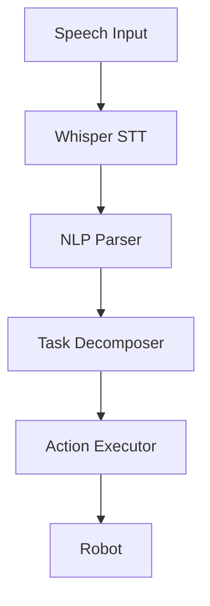
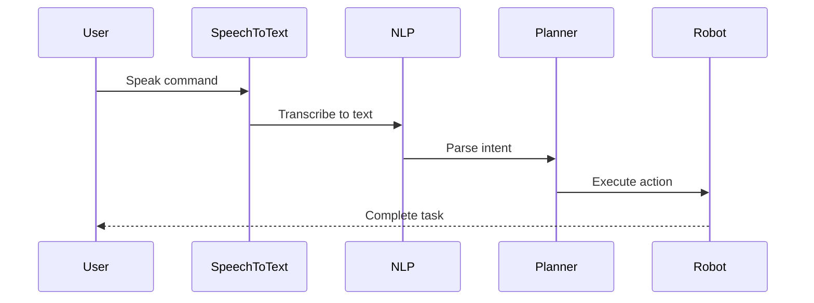

# VLA Module Style Guide

This document outlines the formatting standards and templates for code examples and diagrams in the Vision-Language-Action module.

## Code Examples

### Python Code Blocks
```python
import rospy
from std_msgs.msg import String

def speech_to_text_callback(data):
    """
    Process incoming speech data and convert to text
    """
    # Process the audio data
    transcription = whisper_model.transcribe(data.audio)
    return transcription
```

### ROS 2 Launch Files
```xml
<launch>
  <!-- Speech-to-text node -->
  <node pkg="vla_speech" exec="speech_to_text_node" name="speech_to_text">
    <param name="model_path" value="whisper-base"/>
    <param name="sample_rate" value="16000"/>
  </node>
</launch>
```

### Command Line Examples
```bash
# Start the VLA system
ros2 launch vla_system vla_system.launch.py

# Test speech input
ros2 run vla_speech test_speech_input --text "Go to the kitchen and bring me an apple"
```

## Diagram Templates

### Architecture Diagrams
Use Mermaid diagrams to illustrate system architecture:



### Process Flow Diagrams
Use sequence diagrams for process flows:



## Document Structure

Each chapter should follow this structure:

1. **Learning Objectives** - What students will learn
2. **Conceptual Overview** - Theoretical background
3. **Technical Implementation** - Practical steps
4. **Code Examples** - Working code snippets
5. **Exercises** - Hands-on practice
6. **Summary** - Key takeaways
7. **Further Reading** - Additional resources

## Cross-References

When referencing other modules or chapters, use relative links:

- Link to Module 1: [ROS 2 Fundamentals](../module-1-ros2/chapter-1-introduction.md)
- Link to Module 3: [Isaac Platform](../module-3-ai-robot-brain/chapter-2-isaac-platform.md)
- Link within module: [Previous Chapter](./chapter-1-vla-physical-ai.md)