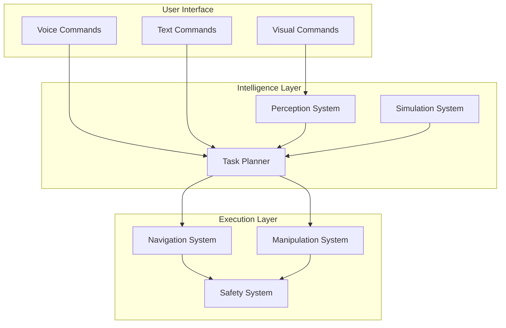

# Capstone Project Template

## Overview

This template provides a structured approach for implementing your own capstone project that integrates all concepts from the Physical AI and Humanoid Robotics course. Use this template as a guide to develop, document, and evaluate your integrated humanoid robotics system.

## Project Structure Template

```
capstone-project/
├── README.md                    # Project overview and quick start
├── LICENSE                      # License information
├── CITATION.cff                 # Citation information
├── docs/                        # Documentation files
│   ├── project_proposal.md      # Initial project proposal
│   ├── system_architecture.md   # Architecture documentation
│   ├── implementation_guide.md  # Step-by-step implementation
│   ├── evaluation_report.md     # Performance evaluation
│   ├── user_manual.md          # User documentation
│   └── final_report.md         # Comprehensive final report
├── src/                         # Source code
│   ├── perception/             # Perception system components
│   ├── planning/               # Task planning components
│   ├── action/                 # Action execution components
│   ├── simulation/             # Simulation components
│   ├── evaluation/             # Evaluation tools
│   └── utils/                  # Utility functions
├── config/                      # Configuration files
├── launch/                      # ROS 2 launch files
├── test/                        # Test files
├── data/                        # Sample data (if applicable)
├── notebooks/                   # Jupyter notebooks for analysis
├── requirements.txt            # Python dependencies
├── package.xml                 # ROS 2 package information
├── setup.py                    # Python package setup
├── Dockerfile                  # Container definition
└── docker-compose.yml         # Multi-container setup
```

## Phase 1: Project Proposal

### Project Objective Definition
Define your capstone project objectives clearly:

```markdown
# Project Objective

**Primary Goal**: [Define your main objective - e.g., "Create a humanoid robot that can autonomously prepare a simple meal"]

**Secondary Goals**:
- Integrate ROS 2 communication across all components
- Implement AI perception for object recognition
- Create VLA system for natural language interaction
- Demonstrate system in simulation and/or real hardware

**Success Criteria**:
- [ ] Task completion rate > 80%
- [ ] Response time < 5 seconds for simple commands
- [ ] System operates safely in human environment
- [ ] Professional documentation completed
```

### Component Integration Plan
Plan how you'll integrate components from all modules:

| Module | Component | Integration Role | Implementation Notes |
|--------|-----------|------------------|---------------------|
| Module 1 (ROS 2) | Communication framework | System backbone for component coordination | Use services, topics, and actions appropriately |
| Module 2 (Simulation) | Gazebo/Isaac Sim | Testing and validation environment | Create realistic simulation scenarios |
| Module 3 (AI Perception) | Object detection/tracking | Environmental understanding | Integrate with manipulation planning |
| Module 4 (VLA) | Language understanding | Natural interaction interface | Connect to task planning system |
| Module 5 (Real-World) | Hardware interfaces | Physical system operation | Safety systems and calibration |
| Module 6 (Advanced) | Optimization | Performance enhancement | Resource management, efficiency |

## Phase 2: System Architecture Design

### High-Level Architecture
Create your system architecture diagram:



### Component Specifications
Document each major component:

```yaml
components:
  perception_system:
    inputs: ["camera_rgb", "camera_depth", "lidar", "imu"]
    outputs: ["object_detections", "semantic_map", "localization"]
    requirements: ["real_time_processing", "accuracy_threshold: 0.8"]
    interfaces: ["ros2_topics", "parameter_server"]

  task_planner:
    inputs: ["user_commands", "world_state", "object_locations"]
    outputs: ["action_sequences", "execution_status"]
    requirements: ["completeness", "optimality", "safety_constraints"]
    interfaces: ["behavior_trees", "action_lib"]

  action_execution:
    inputs: ["planned_actions", "safety_constraints"]
    outputs: ["execution_feedback", "error_status"]
    requirements: ["precision", "safety", "reliability"]
    interfaces: ["hardware_drivers", "motion_planners"]
```

## Phase 3: Implementation Guidelines

### Development Approach
Follow this iterative development approach:

1. **Prototype Phase**: Implement basic functionality for each component
2. **Integration Phase**: Connect components and test interactions
3. **Optimization Phase**: Improve performance and robustness
4. **Validation Phase**: Test with comprehensive scenarios

### Code Organization
Structure your code following ROS 2 best practices:

```python
# Example node structure
import rclpy
from rclpy.node import Node
from sensor_msgs.msg import Image, LaserScan
from geometry_msgs.msg import Twist
from std_msgs.msg import String

class CapstoneController(Node):
    def __init__(self):
        super().__init__('capstone_controller')

        # Create subscribers
        self.image_sub = self.create_subscription(
            Image, '/camera/rgb/image_raw', self.image_callback, 10
        )
        self.command_sub = self.create_subscription(
            String, '/capstone/command', self.command_callback, 10
        )

        # Create publishers
        self.cmd_vel_pub = self.create_publisher(
            Twist, '/cmd_vel', 10
        )

        # Initialize system components
        self.initialize_perception()
        self.initialize_planning()
        self.initialize_control()

    def image_callback(self, msg):
        # Process image and update perception
        pass

    def command_callback(self, msg):
        # Process command and execute task
        pass
```

## Phase 4: Evaluation Framework

### Performance Metrics Definition
Define metrics for your specific project:

```python
class CapstoneEvaluator:
    def __init__(self):
        self.metrics = {
            'task_completion_rate': 0.0,
            'average_response_time': 0.0,
            'safety_violation_rate': 0.0,
            'user_satisfaction': 0.0,
            'system_reliability': 0.0
        }

    def evaluate_task_completion(self, task_result):
        """Evaluate whether a task was completed successfully"""
        # Implement your evaluation logic
        pass

    def evaluate_efficiency(self, execution_time, optimal_time):
        """Evaluate execution efficiency"""
        efficiency = optimal_time / execution_time
        return min(efficiency, 1.0)  # Cap at 1.0

    def evaluate_safety(self, safety_events):
        """Evaluate safety performance"""
        safety_score = 1.0 - (len(safety_events) / total_operations)
        return max(safety_score, 0.0)
```

### Testing Scenarios
Create comprehensive test scenarios:

```markdown
# Test Scenarios

## Basic Functionality Tests
1. **Simple Navigation Test**
   - Command: "Go to the kitchen"
   - Expected: Robot navigates to kitchen area
   - Success criteria: Reaches within 1m of target

2. **Object Detection Test**
   - Command: "Find the red cup"
   - Expected: Robot identifies and localizes red cup
   - Success criteria: Detection accuracy > 0.8, position error < 0.1m

## Integration Tests
1. **Fetch and Place Task**
   - Command: "Fetch the book from the table and place it on the shelf"
   - Expected: Complete fetch and place operation
   - Success criteria: Object successfully transported, no safety violations

2. **Multi-step Task**
   - Command: "Go to kitchen, find apple, bring to me"
   - Expected: Complete sequence of actions
   - Success criteria: All subtasks completed, total time < 5 minutes

## Stress Tests
1. **Long-duration Operation**
   - Duration: 2+ hours continuous operation
   - Expected: System maintains performance
   - Success criteria: No crashes, performance degradation < 10%

2. **Failure Recovery Test**
   - Induce: Component failure (e.g., perception temporarily disabled)
   - Expected: System recovers gracefully
   - Success criteria: Recovery time < 30 seconds, no safety violations
```

## Phase 5: Documentation Template

### System Documentation
Document your implementation comprehensively:

```markdown
# System Documentation Template

## 1. System Overview
- **Purpose**: [Brief description of your system]
- **Target Application**: [What problem does it solve?]
- **Key Capabilities**: [List main features]
- **Technical Approach**: [High-level technical overview]

## 2. Architecture
- **Component Diagram**: [Include your architecture diagram]
- **Data Flow**: [Describe how data moves through the system]
- **Communication Patterns**: [Describe ROS 2 topics, services, actions]

## 3. Implementation Details
- **Perception System**: [How object detection/localization works]
- **Planning System**: [How tasks are planned and decomposed]
- **Action System**: [How actions are executed]
- **Safety System**: [How safety is ensured]

## 4. Performance Results
- **Quantitative Results**: [Include metrics and charts]
- **Qualitative Results**: [Include videos, images, user feedback]
- **Limitations**: [Honest assessment of system limitations]

## 5. Usage Guide
- **Installation**: [Step-by-step installation instructions]
- **Configuration**: [How to configure the system]
- **Operation**: [How to use the system]
- **Troubleshooting**: [Common issues and solutions]
```

## Phase 6: Professional Presentation

### Presentation Structure
Structure your final presentation effectively:

```markdown
# Presentation Outline

## 1. Introduction (2-3 minutes)
- Problem statement and motivation
- Project objectives
- Key challenges addressed

## 2. System Overview (3-4 minutes)
- High-level system architecture
- Key components and their roles
- Integration approach

## 3. Technical Implementation (4-5 minutes)
- Detailed technical approach for each component
- Key technical innovations or solutions
- Challenges overcome

## 4. Results and Evaluation (3-4 minutes)
- Quantitative results with metrics
- Qualitative results with demonstrations
- Comparison to baseline/expectations

## 5. Lessons Learned (2-3 minutes)
- Key insights from the project
- What worked well, what didn't
- Future improvements

## 6. Conclusion (1-2 minutes)
- Summary of achievements
- Impact and significance
- Next steps
```

## Assessment Rubric Template

Use this rubric to self-assess your project:

| Criteria | Excellent (4) | Good (3) | Satisfactory (2) | Needs Improvement (1) |
|----------|---------------|----------|------------------|----------------------|
| **System Integration** | All components work seamlessly together | Most components integrated well | Basic integration achieved | Limited integration |
| **Technical Implementation** | Sophisticated, well-engineered solution | Solid technical implementation | Adequate technical solution | Basic or flawed implementation |
| **Performance** | Exceeds stated requirements | Meets requirements well | Meets basic requirements | Falls short of requirements |
| **Documentation** | Comprehensive, professional quality | Good documentation quality | Adequate documentation | Poor or incomplete documentation |
| **Presentation** | Clear, engaging, professional | Good presentation quality | Adequate presentation | Unclear or unprofessional |
| **Evaluation** | Thorough, quantitative evaluation | Good evaluation with metrics | Basic evaluation | Limited evaluation |

## Next Steps

1. **Project Planning**: Use this template to structure your project proposal
2. **Implementation**: Follow the development phases outlined above
3. **Evaluation**: Implement the evaluation framework for your specific project
4. **Documentation**: Maintain documentation throughout the development process
5. **Presentation**: Prepare your final presentation using the guidelines above

Remember that the capstone project is your opportunity to demonstrate mastery of all course concepts. Focus on creating a well-integrated, professionally documented system that showcases your learning journey through all seven modules of the course.