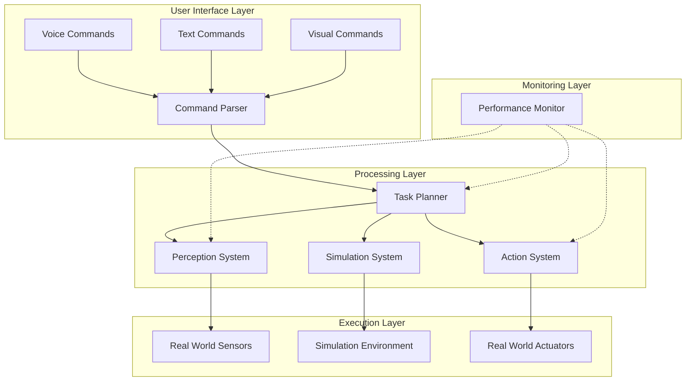

# Chapter 6: Documentation, Demos, and Reproducibility

## Introduction

Professional documentation, compelling demonstrations, and reproducible work are essential components of any successful capstone project. This chapter provides comprehensive guidance on creating high-quality documentation, engaging demonstrations, and reproducible systems that others can understand, validate, and build upon. These professional practices are critical for showcasing your work to potential employers, collaborators, and the broader robotics community.

## Professional Documentation Standards

### Documentation Philosophy

Professional documentation serves multiple audiences and purposes:

- **Technical Audience**: Engineers and researchers needing implementation details
- **Management Audience**: Stakeholders requiring high-level understanding
- **Educational Audience**: Students and newcomers to the field
- **Maintenance Audience**: Future developers needing to modify or extend the system

### Documentation Structure

#### Executive Summary
Provide a high-level overview accessible to non-technical stakeholders.

**Content Requirements**:
- Project objectives and outcomes
- Key technical achievements
- Performance metrics and results
- Business or research impact
- Future directions and recommendations

**Audience**: Executives, project managers, funding agencies

#### Technical Overview
Comprehensive technical description of the system architecture and implementation.

**Content Requirements**:
- System architecture diagrams
- Component descriptions and interfaces
- Design decisions and rationale
- Technology stack and dependencies
- Performance characteristics

**Audience**: Technical leads, system architects, integration engineers

#### Implementation Guide
Step-by-step instructions for reproducing the system.

**Content Requirements**:
- Prerequisites and system requirements
- Installation and setup procedures
- Configuration instructions
- Usage examples and tutorials
- Troubleshooting guide

**Audience**: Developers, researchers, students

#### API and Interface Documentation
Detailed specifications for system components and interfaces.

**Content Requirements**:
- Function/method signatures
- Input/output specifications
- Error conditions and handling
- Example usage scenarios
- Performance considerations

**Audience**: Developers integrating with the system

### Documentation Best Practices

#### Clarity and Precision
- Use clear, concise language avoiding jargon when possible
- Define technical terms when first used
- Provide concrete examples for abstract concepts
- Use consistent terminology throughout
- Include visual aids (diagrams, screenshots, videos)

#### Completeness and Accuracy
- Document all public interfaces and components
- Include both normal operation and error scenarios
- Verify all examples and procedures work as described
- Keep documentation synchronized with code changes
- Include version information and compatibility notes

#### Accessibility and Usability
- Organize information logically with clear navigation
- Use appropriate formatting and structure
- Include search functionality where possible
- Provide multiple formats (online, PDF, etc.)
- Consider accessibility requirements for different users

## System Documentation

### Architecture Documentation

#### High-Level Architecture
Create comprehensive architectural documentation showing system components and their interactions.



#### Component Documentation
Document each major component with detailed specifications:

- **Component Name**: Clear, descriptive name
- **Purpose**: What the component does and why it exists
- **Interfaces**: Input/output specifications, APIs, protocols
- **Dependencies**: What other components it depends on
- **Configuration**: Parameters and settings
- **Performance**: Expected behavior and limits
- **Error Handling**: How it handles errors and failures

### Configuration Documentation

#### System Configuration
Document all system configuration options:

```yaml
# System-wide configuration example
system:
  name: "capstone_humanoid_robot"
  version: "1.0.0"
  environment: "simulation"  # or "real_world"
  log_level: "INFO"  # DEBUG, INFO, WARN, ERROR
  enable_monitoring: true

ros2:
  domain_id: 0
  qos_profile: "sensor_data"  # sensor_data, services, parameters

perception:
  camera_topics:
    - "/camera/rgb/image_raw"
    - "/camera/depth/image_raw"
  detection_threshold: 0.5
  max_objects: 10

planning:
  max_planning_time: 5.0  # seconds
  path_resolution: 0.05   # meters
  safety_margin: 0.3      # meters

action:
  max_velocity: 1.0
  acceleration_limit: 2.0
  force_threshold: 50.0   # Newtons
```

#### Runtime Configuration
Document how to configure the system at runtime:

- Parameter server usage
- Dynamic reconfiguration
- Configuration validation
- Default values and ranges

### Performance Documentation

#### Benchmark Results
Document performance benchmarks with detailed methodology:

```python
# Example performance documentation
class PerformanceReport:
    def __init__(self):
        self.benchmarks = {
            "perception_latency": {
                "description": "Time from image capture to object detection",
                "average": 0.085,  # seconds
                "std_dev": 0.012,
                "percentiles": {"50": 0.082, "95": 0.105, "99": 0.134},
                "test_conditions": {
                    "cpu_load": "45%",
                    "gpu_load": "60%",
                    "image_size": "640x480 RGB"
                }
            },
            "planning_success_rate": {
                "description": "Percentage of successful path plans",
                "value": 0.94,  # 94%
                "test_scenarios": ["empty_room", "cluttered_room", "dynamic_obstacles"]
            }
        }
```

#### Resource Usage
Document resource consumption under various conditions:

- CPU utilization under different loads
- Memory usage for various operations
- Network bandwidth requirements
- Power consumption for mobile platforms

## Demonstration Best Practices

### Demonstration Planning

#### Scenario Design
Create compelling demonstration scenarios that showcase system capabilities:

**Simple Demonstration**: Single-task scenario highlighting basic functionality
- "Fetch a cup from the table"
- Clear, repeatable execution
- Focus on one key capability

**Complex Demonstration**: Multi-step scenario showcasing integration
- "Prepare a simple snack and serve it"
- Multiple capabilities working together
- Realistic task with practical value

**Challenge Demonstration**: Scenario demonstrating robustness
- "Navigate through a cluttered environment"
- Handles unexpected situations
- Shows error recovery and adaptation

#### Audience Considerations
Tailor demonstrations to different audiences:

**Technical Audience**: Focus on implementation details, architecture, and technical challenges
- Emphasize innovative solutions
- Discuss design decisions and trade-offs
- Highlight performance metrics

**Management Audience**: Focus on outcomes, impact, and business value
- Emphasize practical applications
- Discuss scalability and deployment
- Address ROI and strategic value

**Educational Audience**: Focus on learning objectives and concepts
- Explain the educational value
- Highlight key learning points
- Encourage questions and interaction

### Demonstration Execution

#### Setup and Preparation
Ensure demonstrations run smoothly:

- **Environment Setup**: Prepare the demonstration environment in advance
- **Backup Plans**: Have alternative demonstrations ready
- **Rehearsal**: Practice the demonstration multiple times
- **Timing**: Plan for appropriate duration (5-15 minutes for main demos)

#### Live vs. Recorded
Choose appropriate presentation format:

**Live Demonstrations**:
- Pros: Authentic, interactive, shows real-time capability
- Cons: Risk of failure, environmental constraints, timing issues
- Best for: Technical audiences, controlled environments

**Recorded Demonstrations**:
- Pros: Consistent quality, can be edited, risk-free
- Cons: Less interactive, may seem less authentic
- Best for: Online sharing, presentations, marketing materials

#### Interactive Elements
Engage the audience during demonstrations:

- **Real-time Questions**: Allow audience to ask questions during execution
- **Variable Parameters**: Show different behaviors with parameter changes
- **Comparison Scenarios**: Demonstrate before/after improvements
- **Failure Recovery**: Show how the system handles and recovers from issues

### Demonstration Documentation

#### Demonstration Scripts
Create scripts for consistent demonstration delivery:

```markdown
# Fetch and Place Demonstration Script

## Setup
- Robot positioned at starting location
- Target object (red cup) placed on table
- Destination (platform) prepared

## Execution Steps
1. "The robot will now demonstrate a fetch and place task"
2. "First, it will perceive and locate the target object"
3. [Pause for perception] "The red cup has been detected at coordinates (x, y, z)"
4. "Now planning the approach path to the object"
5. [Pause for planning] "Path planning completed, moving to approach position"
6. "Executing grasp maneuver"
7. [Pause for grasp] "Object successfully grasped"
8. "Planning path to destination"
9. "Navigating to destination"
10. "Placing object at destination"
11. "Task completed successfully"

## Expected Duration: 2-3 minutes
## Backup Plan: Use simulation if real-world fails
## Common Issues: Lighting changes, object displacement
```

#### Troubleshooting Guide
Prepare for demonstration issues:

- **Common Failures**: List likely failure points and recovery procedures
- **Quick Fixes**: Simple adjustments that can resolve issues quickly
- **Alternative Demos**: Backup demonstrations if primary fails
- **Explanation Scripts**: How to explain technical issues to audiences

## Reproducibility Standards

### Code Reproducibility

#### Repository Structure
Organize code for easy reproduction:

```
capstone-project/
├── README.md                    # Project overview and quick start
├── LICENSE                      # License information
├── CITATION.cff                 # Citation information
├── docs/                        # Documentation files
│   ├── installation.md
│   ├── usage.md
│   ├── api-reference.md
│   └── tutorials/
├── src/                         # Source code
│   ├── perception/
│   ├── planning/
│   ├── action/
│   └── utils/
├── config/                      # Configuration files
├── launch/                      # ROS 2 launch files
├── test/                        # Test files
├── data/                        # Sample data (if applicable)
├── notebooks/                   # Jupyter notebooks for analysis
├── requirements.txt            # Python dependencies
├── package.xml                 # ROS 2 package information
├── setup.py                    # Python package setup
├── Dockerfile                  # Container definition
└── docker-compose.yml         # Multi-container setup
```

#### Dependency Management
Document and manage dependencies clearly:

```yaml
# For ROS 2 projects - package.xml example
<?xml version="1.0"?>
<?xml-model href="http://download.ros.org/schema/package_format3.xsd" schematypens="http://www.w3.org/2001/XMLSchema"?>
<package format="3">
  <name>capstone_humanoid</name>
  <version>1.0.0</version>
  <description>Capstone project for humanoid robotics integration</description>
  <maintainer email="student@university.edu">Student Name</maintainer>
  <license>Apache-2.0</license>

  <depend>rclpy</depend>
  <depend>std_msgs</depend>
  <depend>sensor_msgs</depend>
  <depend>geometry_msgs</depend>
  <depend>cv_bridge</depend>
  <depend>message_filters</depend>

  <test_depend>ament_copyright</test_depend>
  <test_depend>ament_flake8</test_depend>
  <test_depend>ament_pep257</test_depend>
  <test_depend>python3-pytest</test_depend>

  <export>
    <build_type>ament_python</build_type>
  </export>
</package>
```

#### Version Control Best Practices
Maintain clean, understandable version history:

- **Meaningful Commits**: Each commit should represent a logical change with clear message
- **Branching Strategy**: Use feature branches for development, main for stable code
- **Tagging**: Tag releases and important milestones
- **Issue Tracking**: Link commits to issues or features

### Environment Reproducibility

#### Containerization
Use containers to ensure consistent environments:

```dockerfile
# Example Dockerfile for the project
FROM osrf/ros:humble-desktop-full

# Set environment variables
ENV DEBIAN_FRONTEND=noninteractive
ENV ROS_DISTRO=humble

# Install system dependencies
RUN apt-get update && apt-get install -y \
    python3-pip \
    python3-colcon-common-extensions \
    git \
    wget \
    vim \
    && rm -rf /var/lib/apt/lists/*

# Create workspace
WORKDIR /workspace
RUN mkdir -p src

# Copy project files
COPY . src/capstone_project

# Install Python dependencies
RUN pip3 install --no-cache-dir -r src/capstone_project/requirements.txt

# Build the workspace
RUN source /opt/ros/$ROS_DISTRO/setup.bash && \
    colcon build --packages-select capstone_humanoid

# Source the workspace
RUN echo "source /workspace/install/setup.bash" >> ~/.bashrc

CMD ["bash"]
```

#### Environment Setup Scripts
Provide automated setup procedures:

```bash
#!/bin/bash
# setup.sh - Automated environment setup script

set -e  # Exit on error

echo "Setting up Capstone Humanoid Robotics Environment..."

# Check prerequisites
if ! command -v docker &> /dev/null; then
    echo "Docker is required but not installed. Please install Docker first."
    exit 1
fi

# Clone the repository
if [ ! -d "capstone-project" ]; then
    git clone https://github.com/username/capstone-project.git
fi

cd capstone-project

# Build the Docker image
echo "Building Docker image..."
docker build -t capstone-humanoid:latest .

# Start the container
echo "Starting development container..."
docker run -it \
    --name capstone-dev \
    --network host \
    --device /dev/dri \
    --gpus all \
    -v $(pwd):/workspace/src/capstone_project \
    -e DISPLAY=$DISPLAY \
    -v /tmp/.X11-unix:/tmp/.X11-unix \
    capstone-humanoid:latest

echo "Environment setup complete!"
echo "To run the system: docker exec -it capstone-dev bash"
echo "Then source the workspace: source install/setup.bash"
```

### Data Reproducibility

#### Dataset Documentation
Document datasets used for training and evaluation:

```yaml
# dataset_info.yaml
dataset:
  name: "capstone_humanoid_dataset"
  version: "1.0.0"
  description: "Dataset for training and evaluating humanoid robotics system"
  size: "50GB"
  license: "CC BY 4.0"

content:
  - name: "perception_data"
    type: "images_lidar"
    count: 10000
    description: "Synchronized camera and LIDAR data"
    format: "ROS bags"

  - name: "demonstration_trajectories"
    type: "motion_sequences"
    count: 500
    description: "Human demonstration trajectories"
    format: "joint_space_paths"

  - name: "environment_maps"
    type: "3d_scans"
    count: 50
    description: "3D environment scans"
    format: "PLY_point_clouds"

access:
  repository: "https://github.com/username/capstone-datasets"
  doi: "10.5281/zenodo.xxxxxx"
  requirements: "Academic use only, citation required"
```

#### Experiment Reproducibility
Document experimental procedures for reproducible results:

```python
# experiment_config.py
class ExperimentConfig:
    def __init__(self):
        # Random seed for reproducible results
        self.random_seed = 42

        # Hardware configuration
        self.hardware = {
            "cpu": "Intel i7-10700K",
            "gpu": "NVIDIA RTX 3080",
            "memory": "32GB DDR4",
            "robot_model": "TurtleBot3 Waffle Pi"
        }

        # Software environment
        self.software = {
            "ros_version": "humble",
            "python_version": "3.10.4",
            "cuda_version": "11.8",
            "pytorch_version": "2.0.1"
        }

        # Experimental parameters
        self.parameters = {
            "trial_count": 30,
            "test_duration": 300,  # seconds
            "evaluation_frequency": 10,  # evaluate every 10 seconds
            "data_collection_rate": 10  # Hz
        }

        # Environment conditions
        self.environment = {
            "lighting": "controlled_lab",
            "temperature": "22C",
            "floor_type": "smooth_concrete",
            "obstacle_types": ["static", "dynamic", "cluttered"]
        }
```

## Professional Presentation Skills

### Technical Communication

#### Visual Aids
Create effective visual materials for presentations:

**Architecture Diagrams**: Use clear, well-labeled diagrams showing system components and data flow
- Tools: Mermaid, PlantUML, Draw.io, Visio
- Best practices: Consistent notation, readable labels, appropriate detail level

**Performance Charts**: Present quantitative results clearly
- Tools: Matplotlib, Plotly, Tableau, Excel
- Best practices: Appropriate chart types, clear axes, error bars

**Process Flows**: Show algorithm or system workflows
- Tools: Flowchart software, PowerPoint, Lucidchart
- Best practices: Logical flow, clear decision points, consistent symbols

#### Storytelling Techniques
Structure presentations as compelling narratives:

- **Problem Statement**: Start with the challenge being addressed
- **Approach**: Explain your solution and methodology
- **Results**: Present outcomes and achievements
- **Impact**: Discuss significance and applications
- **Future Work**: Outline next steps and possibilities

### Audience Engagement

#### Interactive Elements
Incorporate audience participation:

- **Polling Questions**: Gauge audience knowledge and interest
- **Live Demos**: Show real-time system operation
- **Q&A Sessions**: Address audience questions and concerns
- **Hands-on Opportunities**: Allow audience to interact with the system

#### Technical Depth Management
Adjust technical level appropriately:

- **For Experts**: Deep technical details, advanced algorithms, optimization
- **For Managers**: Business impact, ROI, strategic value
- **For Students**: Educational value, learning outcomes, concepts
- **For General Audience**: Practical applications, benefits, accessibility

### Professional Presentation Tools

#### Documentation Tools
Use professional documentation tools:

- **Sphinx**: Python documentation generator with API documentation
- **Doxygen**: Multi-language documentation generator
- **JSDoc**: JavaScript documentation tool
- **Docusaurus**: Static site generator for documentation

#### Presentation Tools
Create professional presentations:

- **LaTeX Beamer**: Academic presentation slides with mathematical notation
- **PowerPoint**: Professional slide presentations with animations
- **Prezi**: Dynamic, zoomable presentations
- **Reveal.js**: HTML-based presentation framework

## Reproducibility Checklist

### Pre-Publication Checklist
Verify reproducibility before sharing work:

- [ ] Code repository includes all necessary files
- [ ] Dependencies are clearly documented
- [ ] Environment setup instructions are complete
- [ ] Sample data or data access instructions provided
- [ ] Test cases included and passing
- [ ] Documentation is comprehensive and accurate
- [ ] Installation and usage instructions tested
- [ ] Licensing information included
- [ ] Citation information provided
- [ ] Performance benchmarks documented

### Continuous Reproducibility
Maintain reproducibility over time:

- **Regular Testing**: Automate testing of installation and basic functionality
- **Dependency Updates**: Monitor and update dependencies as needed
- **Documentation Updates**: Keep documentation synchronized with code
- **User Feedback**: Collect and address user experience feedback
- **Version Management**: Maintain stable releases alongside development

## Industry Best Practices

### Open Source Guidelines
Follow open source best practices:

- **Clear Licensing**: Use appropriate open source licenses
- **Contribution Guidelines**: Provide clear contribution instructions
- **Code of Conduct**: Establish community guidelines
- **Issue Templates**: Standardize issue reporting
- **Pull Request Templates**: Standardize contribution process

### Professional Standards
Adhere to professional standards:

- **IEEE Software Engineering Standards**: Follow established software engineering practices
- **Robotics Standards**: Adhere to relevant robotics and automation standards
- **Documentation Standards**: Follow industry-standard documentation practices
- **Testing Standards**: Implement comprehensive testing procedures
- **Security Standards**: Address security considerations in robotics systems

## Next Steps

In the final chapter of this module, we will explore how to connect your capstone work to real-world applications, discussing industry deployment considerations, career preparation, and pathways from academic projects to practical implementations.

## Chapter Navigation

- **Previous**: [Chapter 5 - Failure Modes](./chapter-5-failure-modes.md)
- **Next**: [Chapter 7 - Real-World Applications](./chapter-7-real-world-applications.md)
- **Up**: [Module 7 Overview](./index.md)